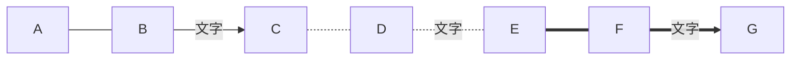
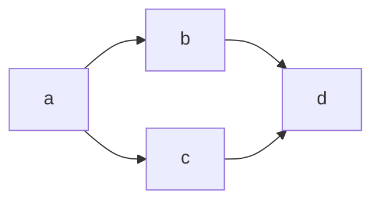
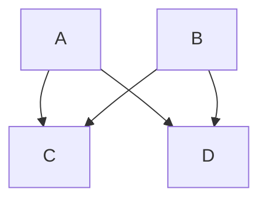
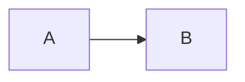
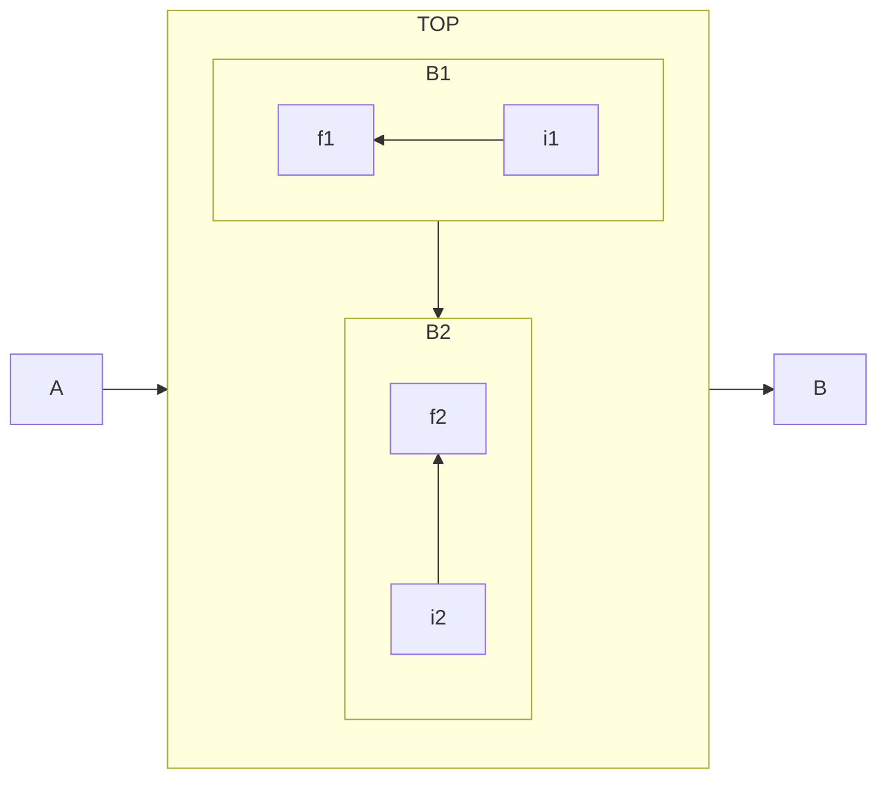

## 流程图

流程图是对过程、算法、流程的一种图像表示，在技术设计、交流及商业简报等领域有广泛的应用。
通常用一些图框来表示各种类型的操作，在框内写出各个步骤，然后用带箭头的线把它们连接起来，
以表示执行的先后顺序。用图形表示算法，直观形象，易于理解。有时候也被称之为输入-输出图。
顾名思义，就是用来直观地描述一个工作过程的具体步骤。这种过程既可以是生产线上的工艺流程，
也可以是完成一项任务所必需的管理过程。

[mermaid flowchart文档](https://mermaid-js.github.io/mermaid/#/flowchart){:target="_blank"}

mermaid关键字`flowchart`

## 图例方向
    
|关键字|描述|
|:---|:---|
|TB|top to bottom, 从顶到底|
|TD|top-down, 同TB|
|BT|bottom to top, 从底到顶|
|RL|right to left, 从右到左|
|LR|left to right, 从左到右|

## 节点形状

<table>
  <thead>
    <tr>
        <th>形状</th>
        <th>效果</th>
    </tr>
  </thead>
  <tbody>
    <tr>
        <td>(圆角)</td>
        <td>
<pre class="highlight">
<code class="language-mermaid">
flowchart LR
id1(圆角)
</code>
</pre>
</td>
    </tr>
<tr>
        <td>([圆边])</td>
        <td>
<pre class="highlight">
<code class="language-mermaid">
flowchart LR
id1([圆边])
</code>
</pre>
</td>
    </tr>
<tr>
<td>[[子程序]]</td>
<td>
<pre class="highlight">
<code class="language-mermaid">
flowchart LR
id1[[子程序]]
</code>
</pre>
</td>
</tr>

<tr>
<td>((圆形))</td>
<td>
<pre class="highlight">
<code class="language-mermaid">
flowchart LR
id1((圆形))
</code>
</pre>
</td>
</tr>

<tr>
<td>[(圆柱体)]</td>
<td>
<pre class="highlight">
<code class="language-mermaid">
flowchart LR
id1[(圆柱体)]
</code>
</pre>
</td>
</tr>

<tr>
<td>>不对称的]</td>
<td>
<pre class="highlight">
<code class="language-mermaid">
flowchart LR
id1>不对称的]
</code>
</pre>
</td>
</tr>

<tr>
<td>{菱形}</td>
<td>
<pre class="highlight">
<code class="language-mermaid">
flowchart LR
id1{菱形}
</code>
</pre>
</td>
</tr>

<tr>
<td>{{'{{'}}六边形}}</td>
<td>
<pre class="highlight">
<code class="language-mermaid">
flowchart LR
id1{{'{{'}}六边形}}
</code>
</pre>
</td>
</tr>

<tr>
<td>[/平行四边形/]</td>
<td>
<pre class="highlight">
<code class="language-mermaid">
flowchart LR
id1[/平行四边形/]
</code>
</pre>
</td>
</tr>

<tr>
<td>[/梯形\]</td>
<td>
<pre class="highlight">
<code class="language-mermaid">
flowchart LR
id1[/梯形\]
</code>
</pre>
</td>
</tr>

</tbody>
</table>

## 连接

### 连接符号

<table>    
<thead>
<tr>
<th>连接</th>
<th>代码</th>
<th>效果</th>
</tr>
</thead>
<tbody>
<tr>
<td>--直线---</td>
<td>
<pre class="highlight">
<code>
flowchart LR
A --- B
C --直线--- D
E ---|直线| F
</code>
</pre>
</td>
<td>
<pre class="highlight">
<code class="language-mermaid">
flowchart LR
A --- B
C --直线--- D
E ---|直线| F
</code>
</pre>
</td>
</tr>
<tr>
<td>--箭头直线--></td>
<td>
<pre class="highlight">
<code>
flowchart LR
A --> B
C --箭头直线--> D
E -->|箭头直线| F
</code>
</pre>
</td>
<td>
<pre class="highlight">
<code class="language-mermaid">
flowchart LR
A --> B
C --箭头直线--> D
E -->|箭头直线| F
</code>
</pre>
</td>
</tr>
<tr>
<td>==粗直线===</td>
<td>
<pre class="highlight">
<code>
flowchart LR
A === B
C ==直线=== D
E ===|直线| F
</code>
</pre>
</td>
<td>
<pre class="highlight">
<code class="language-mermaid">
flowchart LR
A === B
C ==直线=== D
E ===|直线| F
</code>
</pre>
</td>
</tr>
<tr>
<td>==粗箭头直线==></td>
<td>
<pre class="highlight">
<code>
flowchart LR
A ==> B
C ==粗箭头直线==> D
E ==>|粗箭头直线| F
</code>
</pre>
</td>
<td>
<pre class="highlight">
<code class="language-mermaid">
flowchart LR
A ==> B
C ==粗箭头直线==> D
E ==>|粗箭头直线| F
</code>
</pre>
</td>
</tr>
<tr>
<td>-.虚线.-</td>
<td>
<pre class="highlight">
<code>
flowchart LR
A -.- B
C -.虚线.- D
E -.-|虚线| F
</code>
</pre>
</td>
<td>
<pre class="highlight">
<code class="language-mermaid">
flowchart LR
A -.- B
C -.虚线.- D
E -.-|虚线| F
</code>
</pre>
</td>
</tr>
<tr>
<td>-.箭头虚线.-></td>
<td>
<pre class="highlight">
<code>
flowchart LR
A -.-> B
C -.箭头虚线.-> D
E -.->|箭头虚线| F
</code>
</pre>
</td>
<td>
<pre class="highlight">
<code class="language-mermaid">
flowchart LR
A -.-> B
C -.箭头虚线.-> D
E -.->|箭头虚线| F
</code>
</pre>
</td>
</tr>
</tbody>
</table>

### 连接长度
        
|连接类型|长度1|长度2|长度3|
|:---|:---|:---|
|直线|`---`|`----`|`-----`|
|箭头直线|`-->`|`--->`|`---->`|
|粗直线|`===`|`====`|`=====`|
|粗箭头直线|`==>`|`===>`|`====>`|
|虚线|`-.-`|`-..-`|`-...-`|
|箭头虚线|`-.->`|`-..->`|`-...->`|
      
### 连接链
#### 连续连接

```
flowchart LR
A --- B --文字--> C -.- D -.文字.- E === F ==文字==> G
```


#### 相同线连接

```
flowchart LR
a --> b & c--> d
```

```
flowchart TD
A & B--> C & D
```

   
## 超链接
```
flowchart LR
    A-->B
    click A "https://mermaid-js.github.io/" _blank
    click B "https://www.xiehai.win" _blank
```


## 子图
```
flowchart LR
  subgraph TOP
    direction TB
    subgraph B1
        direction RL
        i1 -->f1
    end
    subgraph B2
        direction BT
        i2 -->f2
    end
  end
  A --> TOP --> B
  B1 --> B2
```


