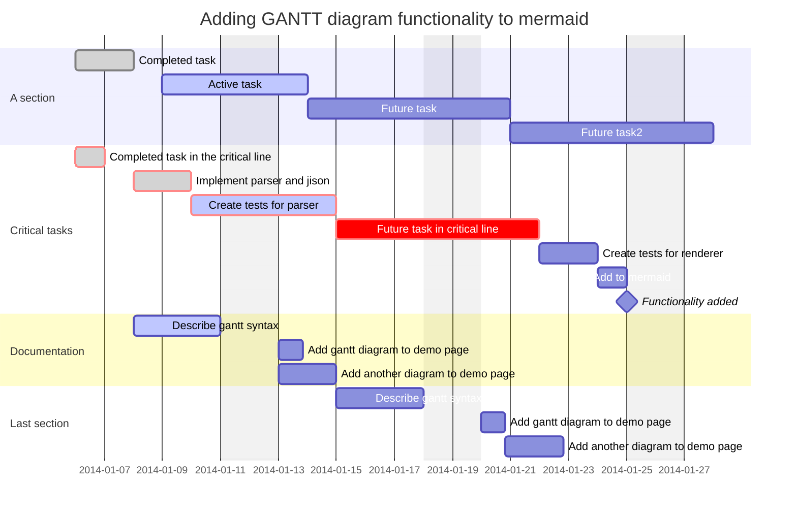
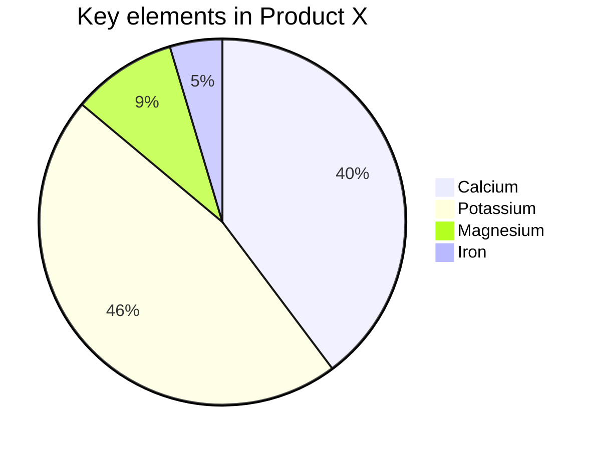

## ER图
E-R图也称实体-联系图(Entity Relationship Diagram)，提供了表示实体类型、属性和联系的方法，用来描述现实世界的概念模型。

[mermaid entityRelationshipDiagram](https://mermaid-js.github.io/mermaid/#/entityRelationshipDiagram){:target="_blank"}

mermaid关键字`erDiagram`

### 关系

|左值|右值|含义|
|:---|:---|:---|
|`|o`|`o|`|0个或1个|
|`||`|`||`|有且仅有1个|
|`}o`|`o{`|0个或多个|
|`}|`|`|{`|1个或多个|

### 示例

<table>
<tr>
<td><pre>
erDiagram
    CAR ||--o{ NAMED-DRIVER : allows
    CAR {
        string registrationNumber
        string make
        string model
    }
    PERSON ||--o{ NAMED-DRIVER : is
    PERSON {
        string firstName
        string lastName
        int age
    }
</pre></td>
<td><pre><code class="language-mermaid">
erDiagram
    CAR ||--o{ NAMED-DRIVER : allows
    CAR {
        string registrationNumber
        string make
        string model
    }
    PERSON ||--o{ NAMED-DRIVER : is
    PERSON {
        string firstName
        string lastName
        int age
    }
</code></pre></td>
</tr>
</table>

## [甘特图](https://mermaid-js.github.io/mermaid/#/gantt){:target="_blank"}

每项任务描述有5个配置，其含义如下

|位置|含义|可选值|
|:---|:---|:---|
|1|是否关键|`crit/缺省`，crit会展示为红色|
|2|状态|`done/active/缺省`，完成灰色/激活为蓝色|
|3|别名|`给定别名/缺省`任务别名|
|4|任务开始时间|`YYYY-MM-DD/after 其他代号/缺省`|
|5|任务结束时间|`YYYY-MM-DD/持续时长/缺省`，h表示小时，d表示天，w表示周|

```
gantt
    dateFormat  YYYY-MM-DD
    title       Adding GANTT diagram functionality to mermaid
    excludes    weekends
    %% (`excludes` accepts specific dates in YYYY-MM-DD format, days of the week ("sunday") or "weekends", but not the word "weekdays".)

    section A section
    Completed task            :done,    des1, 2014-01-06,2014-01-08
    Active task               :active,  des2, 2014-01-09, 3d
    Future task               :         des3, after des2, 5d
    Future task2              :         des4, after des3, 5d

    section Critical tasks
    Completed task in the critical line :crit, done, 2014-01-06,24h
    Implement parser and jison          :crit, done, after des1, 2d
    Create tests for parser             :crit, active, 3d
    Future task in critical line        :crit, 5d
    Create tests for renderer           :2d
    Add to mermaid                      :1d
    Functionality added                 :milestone, 2014-01-25, 0d

    section Documentation
    Describe gantt syntax               :active, a1, after des1, 3d
    Add gantt diagram to demo page      :after a1  , 20h
    Add another diagram to demo page    :doc1, after a1  , 48h

    section Last section
    Describe gantt syntax               :after doc1, 3d
    Add gantt diagram to demo page      :20h
    Add another diagram to demo page    :48h
```



## [饼图](https://mermaid-js.github.io/mermaid/#/pie){:target="_blank"}

```
pie
    title Key elements in Product X
    "Calcium" : 42.96
    "Potassium" : 50.05
    "Magnesium" : 10.01
    "Iron" :  5
```

