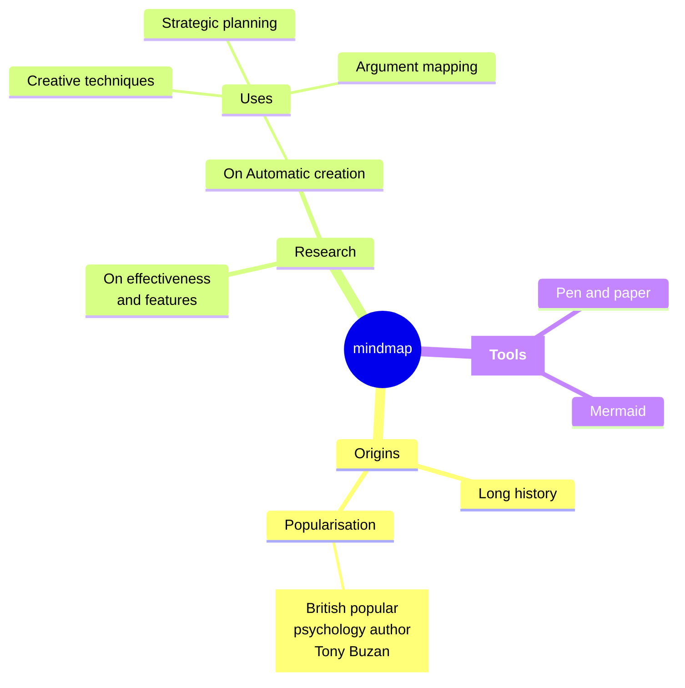

<style>
.test {
  background: #2a6496;
}
</style>

## [思维导图](https://mermaid.js.org/syntax/mindmap.html){:target="_blank"}

思维导图是使用一个中央关键词或想法引起形象化的构造和分类的想法；它用一个中央关键词或想法以辐射线形连接所有的代表字词、想法、任务或其它关联项目的图解方式。

关键字`mindmap`，笔者使用的mermaid的`10.3.0`，当前mindmap还是实验性图，可能将来会改变语法或者配置。

## 基本语法

- 只能有一个根节点
- 层级与层级之间需要有空格区分上下级
- 若相同层级前置空格数量不一致，会被mermaid处理成相同层级

<table>
<tr>
<td width="45%"><pre><code>
mindmap
root["根节点"]
  C1[有个"特殊字符]
    C1-1
    C1-2
  C2
    C2-1
    C2-2
  C3
    C3-1
    C3-2
</code></pre>
</td>
<td width="55%"><pre><code class="language-mermaid">
mindmap
root[根节点]
  C1[有个"特殊字符]
    C1-1
    C1-2
  C2
    C2-1
    C2-2
  C3
    C3-1
    C3-2
</code></pre></td>
</tr>
</table>

### 节点形状

<table>
<tr>
<th>语法</th>
<th>效果</th>
</tr>
<tr>
<td> [默认形状矩形]</td>
<td><pre><code class="language-mermaid">
mindmap
id[默认形状矩形]
</code></pre></td>
</tr>
<tr>
<td>(圆边)</td>
<td><pre><code class="language-mermaid">
mindmap
id(圆边)
</code></pre></td>
</tr>
<tr>
<td>((圆))</td>
<td><pre><code class="language-mermaid">
mindmap
id((圆))
</code></pre></td>
</tr>
<tr>
<td>)云(</td>
<td><pre><code class="language-mermaid">
mindmap
id)云(
</code></pre></td>
</tr>
<tr>
<td>))碰撞((</td>
<td><pre><code class="language-mermaid">
mindmap
id))碰撞((
</code></pre></td>
</tr>
<tr>
<td>{{六边形}}</td>
<!-- 这里因为liquid模版语法原因 不能直接协作{{六边形}} -->
<td><pre><code class="language-mermaid">
mindmap
id{{六边形}}
</code></pre></td>
</tr>
</table>

### 图标

图标支持[Font Awesome](https://fontawesome.com/v4/icons/){:target="_blank"}、[Material Design](https://fonts.google.com/icons){:target="_blank"}

<table>
<tr>
<td width="45%"><pre><code>
mindmap
ROOT
::icon(fa fa-book)
  C1
  ::icon(fa fa-address-card)
  C2
  ::icon(fa fa-eercast)
</code></pre>
</td>
<td width="55%"><pre><code class="language-mermaid">
mindmap
ROOT
::icon(fa fa-book)
  C1
  ::icon(fa fa-battery-three-quarters)
  C2
  ::icon(fa fa-calendar)
</code></pre></td>
</tr>
</table>

### 内嵌markdown语法

在双引号中加反引号字符串就可以表示为markdown语法，只支持加粗和斜体

<table>
<tr>
<td width="45%"><pre><code>
mindmap
root["`**加粗的根节点**`"]
  C1["`多
行
节
点
`"]
  C2["`*我是斜体*`"]
  C3[我是正常的]
</code></pre>
</td>
<td width="55%"><pre><code class="language-mermaid">
mindmap
root["`**加粗的根节点**`"]
  C1["`多
行
节
点
`"]
  C2["`*我是斜体*`"]
  C3[我是正常的]
</code></pre></td>
</tr>
</table>

## 完整示例

```
mindmap
  root((mindmap)
    Origins
      Long history
      ::icon(fa fa-book)
      Popularisation
        a["`British popular
         psychology author 
         Tony Buzan`"]
    Research
      On effectiveness<br/>and features
      On Automatic creation
        Uses
            Creative techniques
            Strategic planning
            Argument mapping
    Tools["`**Tools**`"]
      Pen and paper
      Mermaid
```

