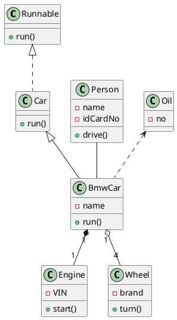
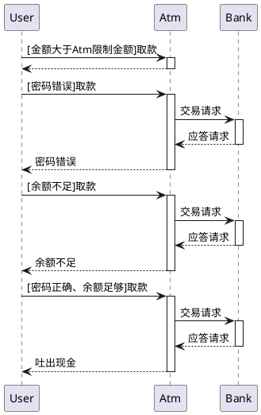

PlantUML是一个通用性很强的工具，可以快速、直接地创建各种图表。
利用简单直观的语言，用户可以毫不费力地绘制各种类型的图表。 
如需详细了解该语言的功能和语法，请参阅[《PlantUML 语言参考指南》](https://plantuml.com/zh/guide)。

## 快速绘制

大多UML图可以在[官网](http://plantuml.com)上找到Demo，这里以常用的为例

### 类图

| 关系                 |  符号   | 说明                                        |
|--------------------|:-----:|:------------------------------------------|
| 泛化(Generalization) | `<--` | 是一种继承关系,表示一般与特殊的关系,它指定了子类如何特化父类的所有特征和行为   |
| 实现(Realization)    | `<..` | 是一种类与接口的关系,表示类是接口所有特征和行为的实现               |
| 关联(Association)    | `--`  | 是一种拥有的关系,它使一个类知道另一个类的属性和方法                |
| 聚合(Aggregation)    | `o--` | 是整体与部分的关系,且部分可以离开整体而单独存在                  |
| 组合(Composition)    | `*--` | 是整体与部分的关系,但部分不能离开整体而单独存在                  |
| 依赖(Dependency)     | `<..` | 是一种使用的关系,即一个类的实现需要另一个类的协助,所以要尽量不使用双向的互相依赖 |

一辆车的基本关系如下：



![p1][1]

### 时序图

去ATM取钱的时序图



![p2][2]

### 活动图

以Java线程状态为例

```plantuml
@startuml
(*)
note left: Start
-> [start()]Runnable
-> [Cpu scheduler]Running
-> [run() completes](*)

Running -> [Cpu scheduler]Runnable

Running -left-> [blocking event]Blocked
-->Runnable

Running --> [synchronized]Blocked in object's lock pool

Running
--> [wait() must have lock]Blocked in object's wait pool
--> [notify()/interrupt()]Blocked in object's lock pool

"Blocked in object's lock pool"
-up-> [acquires lock]Runnable
@enduml
```

![p3][3]

## 参考资料

<LinkCard link="http://plantuml.com"
logo="https://plantuml.com/favicon.ico"
title="使用简单的文字描述画UML图的开源工具。"
description="轻松从简单的文字说明创建UML图。也有许多种可用的图表。它也可以以PNG，LaTeX，EPS，SVG格式图像导出。"
/>

<LinkCard link="http://blog.csdn.net/imduan/article/details/53857921"
logo="https://g.csdnimg.cn/static/logo/favicon32.ico"
title="IDEA PlantUML画图神器_idea画图-CSDN博客。"
description="使用编程语言来描述图表，自动绘图.1.idea打开setting 2.找到pulgin. add plantuml integration 3.可能遇到，cannot find Graphviz，安装Graphviz 4.画个图试试吧@startumlabstract class AbstractListabstract AbstractCollectioninterface Listi_idea画图"
/>

<LinkCard link="https://github.com/yjpark/jekyll-plantuml"
logo="https://github.com/favicon.ico"
title="yjpark/jekyll-plantuml: Jekyll / Octopress plugin to generate PlantUML diagrams."
description="Jekyll / Octopress plugin to generate PlantUML diagrams - yjpark/jekyll-plantuml"
/>

<LinkCard link="https://github.com/lyhcode/gitbook-plugin-plantuml"
logo="https://github.com/favicon.ico"
title="lyhcode/gitbook-plugin-plantuml: Gitbook PlantUml plugin is used to select from markdown uml and converting it into a picture format svg."
description="Gitbook PlantUml plugin is used to select from markdown uml and converting it into a picture format svg. - lyhcode/gitbook-plugin-plantuml"
/>

[1]: /assets/2017/09-25/class-diagram.png
[2]: /assets/2017/09-25/sequence-diagram.png
[3]: /assets/2017/09-25/state-diagram.png
