它通过描述对象之间发送消息的时间顺序显示多个对象之间的动态协作。它可以表示用例的行为顺序，当执行一个用例行为时，
时序图中的每条消息对应了一个类操作或状态机中引起转换的触发事件。

[mermaid sequenceDiagram](https://mermaid.js.org/syntax/sequenceDiagram.html)

mermaid关键字`sequenceDiagram`

## 连接线

<table style="table-layout: auto">
<thead>
    <tr>
        <th width="13%">连线名称</th>
        <th width="37%">代码</th>
        <th width="50%">效果</th>
    </tr>
</thead>
<tbody>
<tr>
<td>

直线  
`->`

</td>
<td>

```mmd
sequenceDiagram
    participant Alice as Alice
    participant Bob as Bob
    Alice->Bob: 直线
```

</td>
<td>

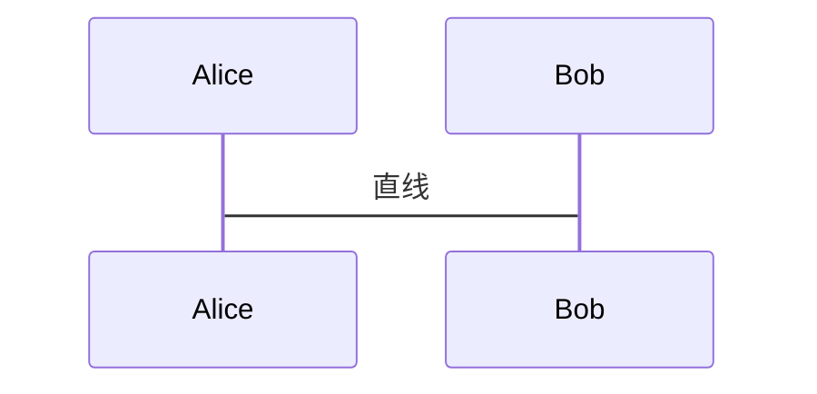

</td>
</tr>
<tr>
<td>

直线箭头  
`->>`

</td>
<td>

```mmd
sequenceDiagram
    participant Alice as Alice
    participant Bob as Bob
    Alice->>Bob: 直线箭头
```

</td>
<td>

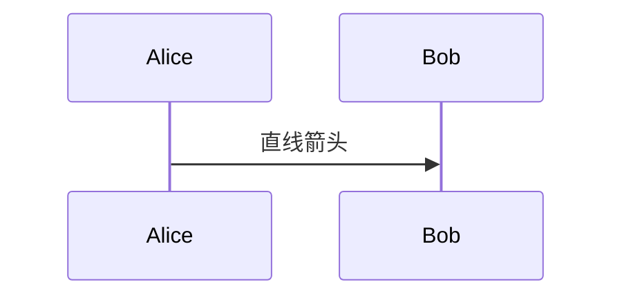

</td>
</tr>
<tr>
<td>

虚线  
`-->`

</td>
<td>

```mmd
sequenceDiagram
    participant Alice as Alice
    participant Bob as Bob
    Alice-->Bob: 虚线
```

</td>
<td>

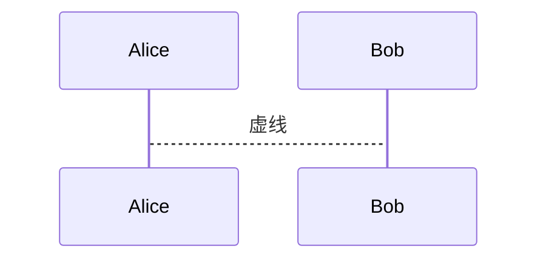

</td>
</tr>
<tr>
<td>

虚线箭头  
`-->>`

</td>
<td>

```mmd
sequenceDiagram
    participant Alice as Alice
    participant Bob as Bob
    Alice-->>Bob: 虚线箭头
```

</td>
<td>

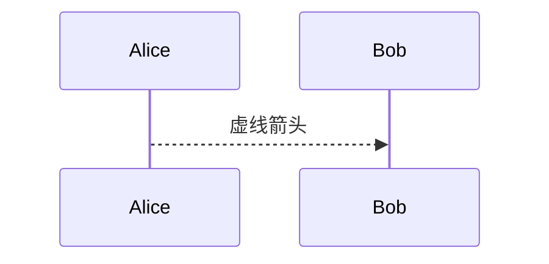

</td>
</tr>
<tr>
<td>

直叉线箭头  
`-x`

</td>
<td>

```mmd
sequenceDiagram
    participant Alice as Alice
    participant Bob as Bob
    Alice-xBob: 直叉线箭头
```

</td>
<td>

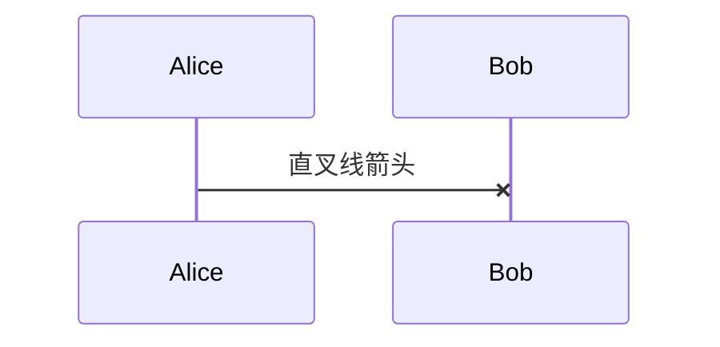

</td>
</tr>
<tr>
<td>

虚叉线箭头  
`--x` 

</td>
<td>

```mmd
sequenceDiagram
    participant Alice as Alice
    participant Bob as Bob
    Alice--xBob: 虚叉线箭头
```

</td>
<td>

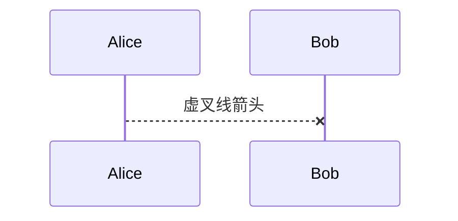

</td>
</tr>
<tr>
<td>

直线圆弧箭头  
`-)`

</td>
<td>

```mmd
sequenceDiagram
    participant Alice as Alice
    participant Bob as Bob
    Alice-)Bob: 直线圆弧箭头
```

</td>
<td>

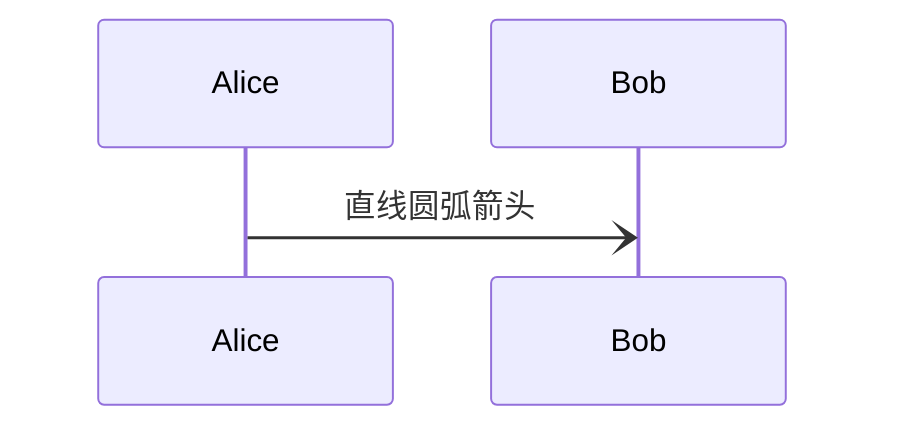

</td>
</tr>
<tr>
<td>

虚线圆弧箭头  
`--)`

</td>
<td>

```mmd
sequenceDiagram
    participant Alice as Alice
    participant Bob as Bob
    Alice--)Bob: 虚线圆弧箭头
```

</td>
<td>

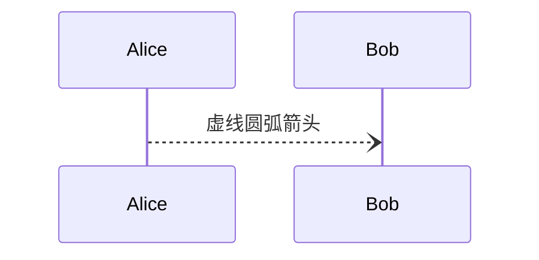

</td>
</tr>
</tbody>
</table>

## 参与者
参与者可以是`participant`或`actor`，可以通过`as`别名。

<table>
<tr>
<td width="37%">

```mmd
sequenceDiagram
    actor A as Alice
    participant J as John
    A->>J: Hello John, how are you?
    J->>A: Great!
```

</td>
<td>

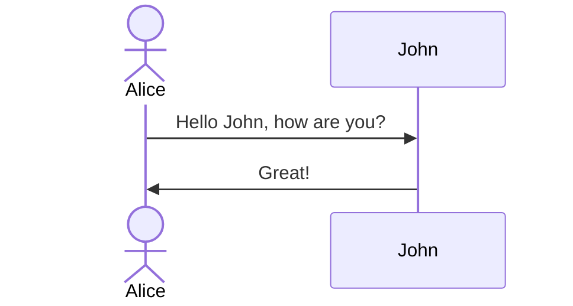

</td>
</tr>
</table>

## 备注
备注语法`note [right of | left of | over ] [Actor]`

<table>
<tr>
<td width="37%">

```mmd
sequenceDiagram
    A ->> B: I'm A
    note right of B: note right of B
    note left of A: note left of A
    note over A, B: note over A, B
```

</td>
<td>

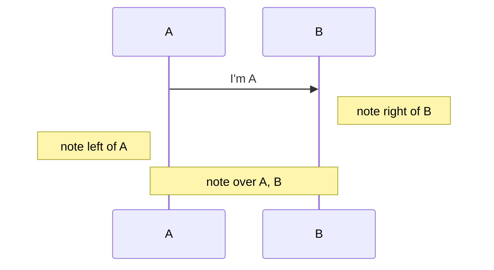

</td>
</tr>
</table>

## 抉择(alt)
用来指明在两个或很多其它的消息序列之间的相互排斥的选择，相当于if..else..

<table>
<tr>
<td width="37%">

```mmd
sequenceDiagram
    Alice->>Bob: Hello Bob, how are you?
    alt is sick
        Bob->>Alice: Not so good :(
    else is well
        Bob->>Alice: Feeling fresh like a daisy
    end
```

</td>
<td>

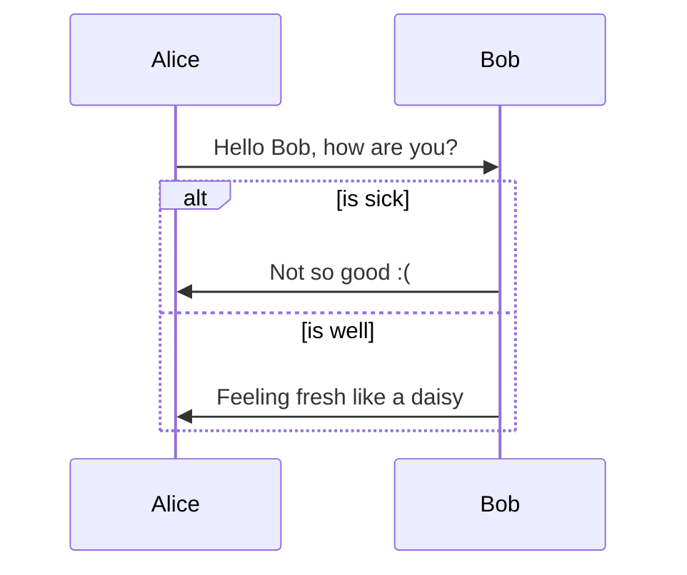

</td>
</tr>
</table>

## 选项(opt)
表示一个可能或不可能发生的序列

<table>
<tr>
<td width="40%">

```mmd
sequenceDiagram
    actor C as 顾客
    actor A as 售货员
    C ->> A: 买瓶可乐
    opt 代金券
    C ->> A: 我有代金券
    end
    A ->> C: 给你可乐
```

</td>
<td>

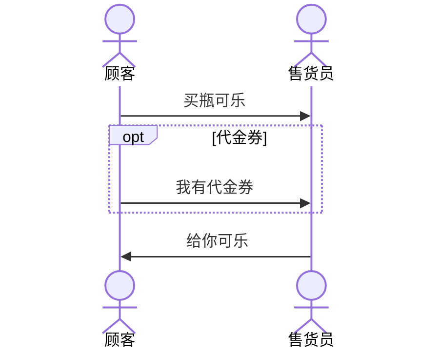

</td>
</tr>
</table>

## 循环(loop)
片段反复一定次数。 能够在临界中指示片段反复的条件

<table>
<tr>
<td width="40%">

```mmd
sequenceDiagram
    Alice->>John: Hello John, how are you?
    loop Every minute
        John-->>Alice: Great!
    end
```

</td>
<td>

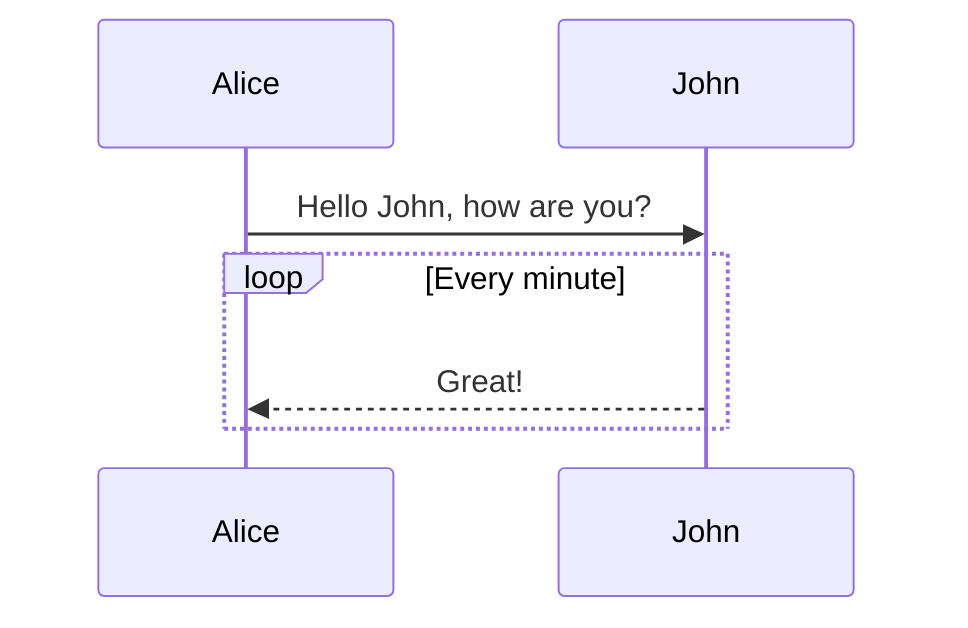

</td>
</tr>
</table>

## 并行(par)
并行发生的序列

<table>
<tr>
<td width="40%">

```mmd
sequenceDiagram
    actor u1 as user1
    actor u2 as user2
    participant w as PasseRR's Blog
    par user1 visit blog
        u1 ->> w: click blog page
    and user2 visit open source
        u2 ->> w: click open source page
    end
    w -->> u1: blog page view
    w -->> u2: open source page view
```

</td>
<td>

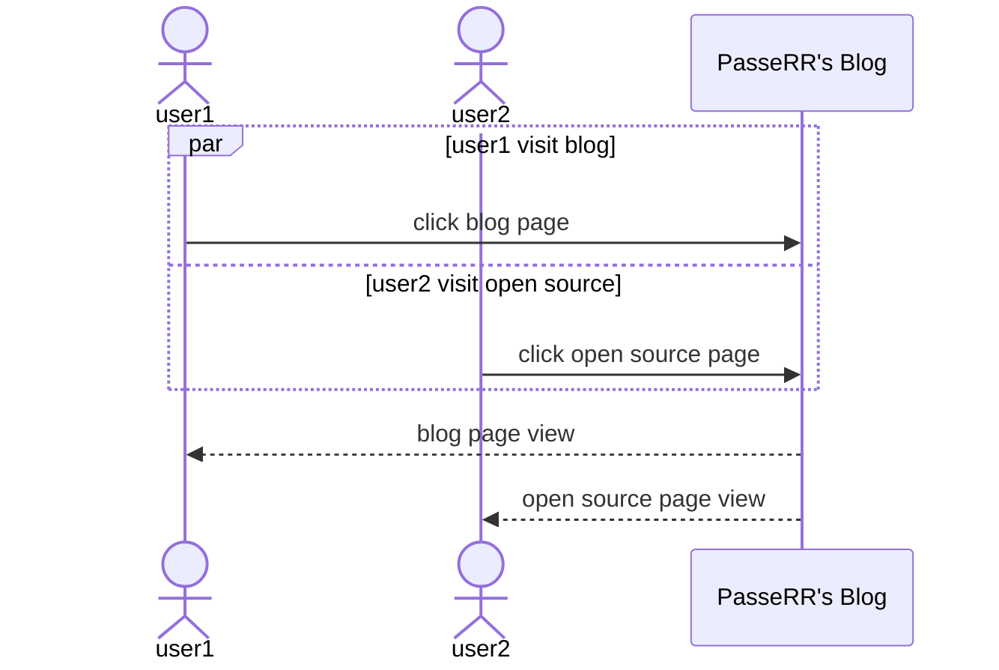

</td>
</tr>
</table>

## 参与者菜单
只对`participant`有效

```mmd
sequenceDiagram
    participant Alice
    participant John
    link Alice: blog @ https://www.xiehai.win
    link Alice: ebook @ https://www.xiehai.win/ebook.html
    links John: {"open source": "https://www.xiehai.win/open-source.html", "message board": "https://www.xiehai.win/messages-board.html"}
```


## 激活状态

可以激活/解除激活某个参与者。

<table>
<tr>
<td width="40%">

```mmd
sequenceDiagram
    Alice->>John: Hello John, how are you?
    activate John # [!code error]
    John-->>Alice: Great!
    deactivate John # [!code error]
```

</td>

<td>

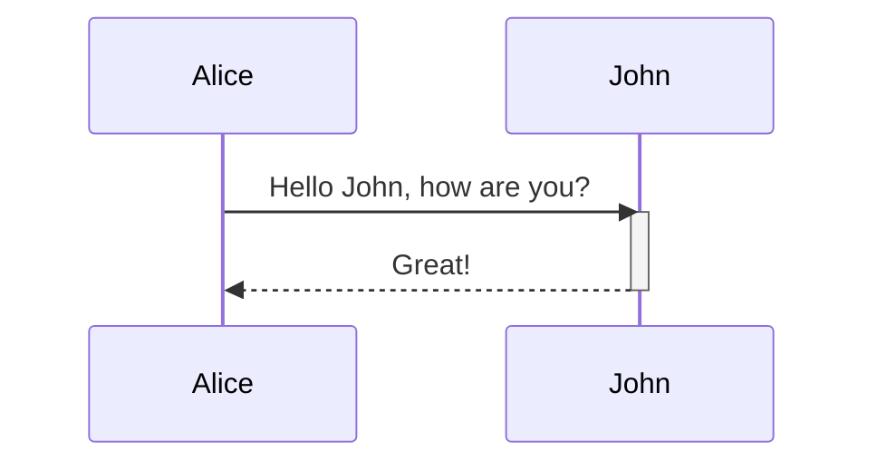

</td>
</tr>
</table>

## 序号

支持将序列图序号添加到每个序列的开始位置，这个特性需要在初始化mermaid的时候设置。

```javascript
mermaid.initialize({sequence: { showSequenceNumbers: true }});
```

```mmd
sequenceDiagram
    autonumber # [!code error]
    Alice->>John: Hello John, how are you?
    loop HealthCheck
        John->>John: Fight against hypochondria
    end
    Note right of John: Rational thoughts!
    John-->>Alice: Great!
    John->>Bob: How about you?
    Bob-->>John: Jolly good!
```

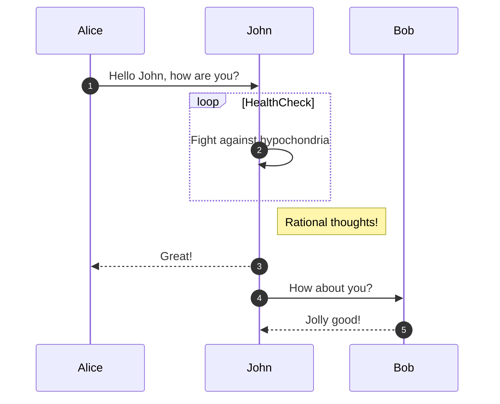

## [综合示例](https://mermaid-js.github.io/mermaid/#/examples?id=sequencediagram-message-to-self-in-loop)

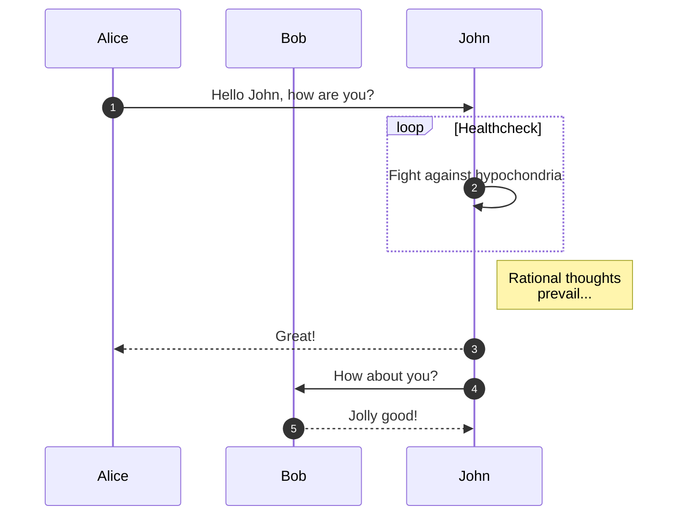
