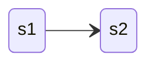
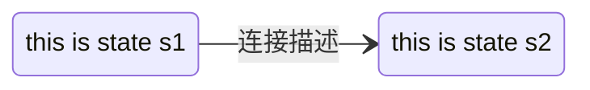
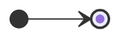
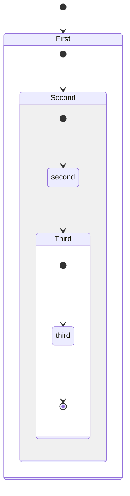
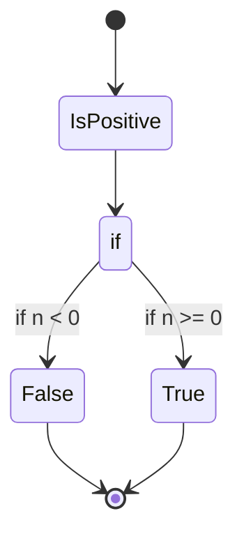
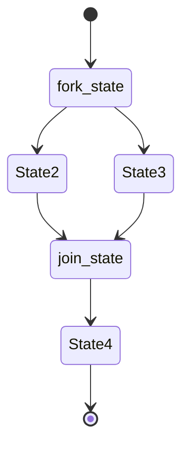
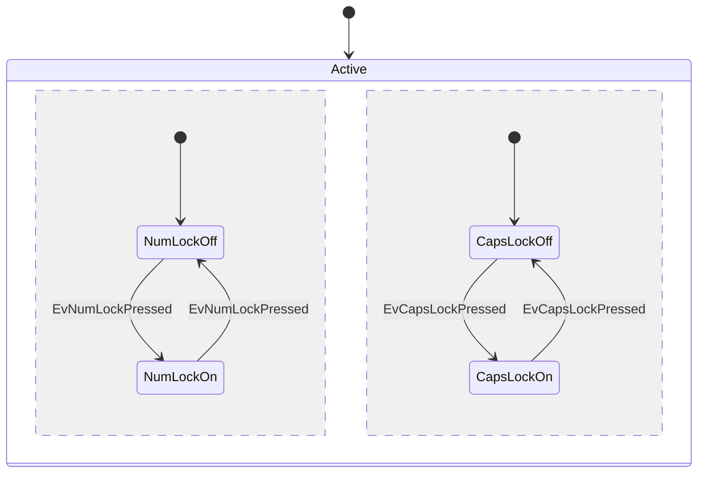
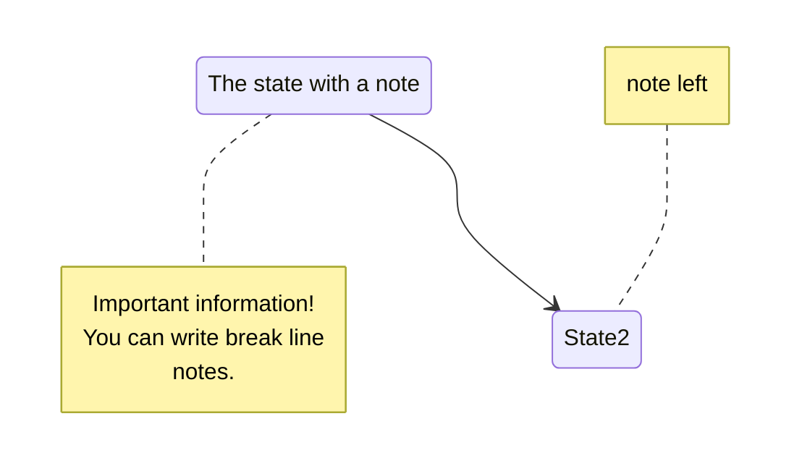
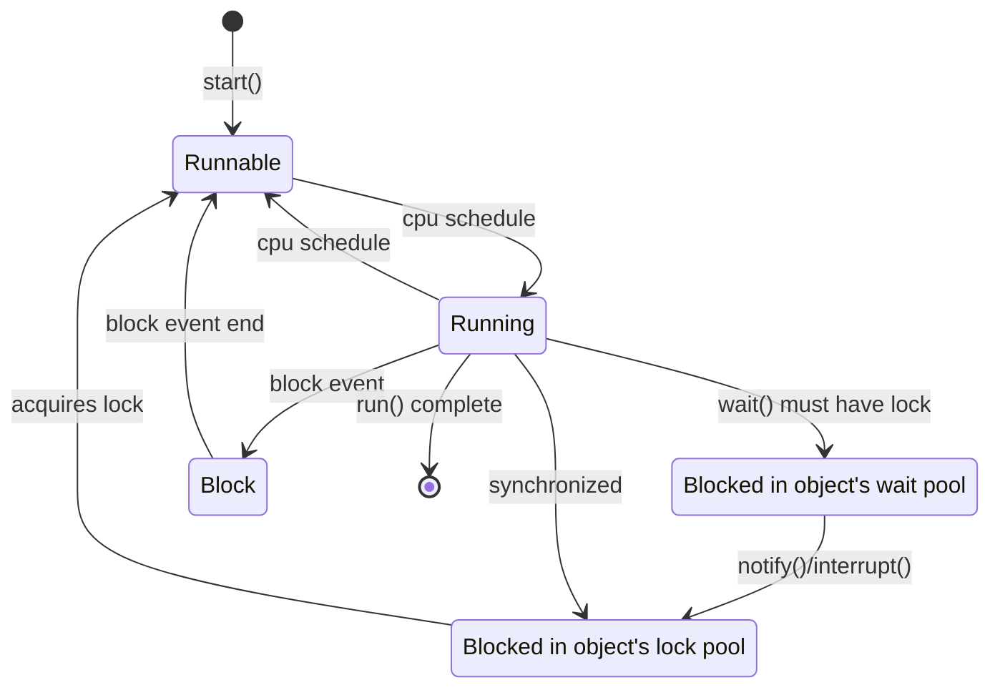

状态图(Statechart Diagram)是描述一个实体基于事件反应的动态行为，显示了该实体如何根据当前所处的状态对不同的事件做出反应。

[mermaid stateDiagram](https://mermaid-js.github.io/mermaid/#/stateDiagram)

mermaid关键字`stateDiagram`或`stateDiagram-v2`

## 方向

语法`direction TB/BT/RL/LR`，默认`TB`

## 状态定义

<table>
<tr>
<td>简单状态</td>
<td>

```mmd
stateDiagram-v2
direction LR
s1 --> s2
```

</td>
<td>



</td>
</tr>

<tr>
<td>别名</td>
<td>

```mmd
stateDiagram-v2
direction LR
state "this is state s1" as s1
s2: this is state s2
s1 --> s2: 连接描述
```

</td>
<td>



</td>
</tr>

<tr>
<td>开始和结束</td>
<td>

```mmd
stateDiagram-v2
direction LR
%% [*]在左边表示开始右边表示结束
[*] --> [*]
```

</td>
<td>



</td>
</tr>

<tr>
<td>复合状态</td>
<td>

```mmd
stateDiagram-v2
[*] --> First

state First {
    [*] --> Second

    state Second {
        [*] --> second
        second --> Third

        state Third {
            [*] --> third
            third --> [*]
        }
    }
}
```

</td>
<td>



</td>
</tr>

<tr>
<td>选择</td>
<td>

```mmd
stateDiagram-v2
    %% 关键语法
    state if_state &lt;&lt;choice>>
    [*] --> IsPositive
    IsPositive --> if_state
    if_state --> False: if n < 0
    if_state --> True : if n >= 0
    False --> [*]
    True --> [*]
```

</td>
<td>



</td>
</tr>

<tr>
<td>fork/join状态</td>
<td>

```mmd
stateDiagram-v2
    state fork_state &lt;&lt;fork>>
    %% fork语法
    [*] --> fork_state
    fork_state --> State2
    fork_state --> State3
    %% join语法
    state join_state &lt;&lt;join>>
    State2 --> join_state
    State3 --> join_state
    join_state --> State4
    State4 --> [*]
```

</td>
<td>



</td>
</tr>

<tr>
<td>并发状态</td>
<td>

```mmd
stateDiagram-v2
    [*] --> Active
    state Active {
        [*] --> NumLockOff
        NumLockOff --> 
        NumLockOn : EvNumLockPressed
        NumLockOn --> 
        NumLockOff : EvNumLockPressed
        --
        [*] --> CapsLockOff
        CapsLockOff --> 
        CapsLockOn : EvCapsLockPressed
        CapsLockOn --> 
        CapsLockOff : EvCapsLockPressed
    }
```

</td>
<td>



</td>
</tr>

<tr>
<td>备注</td>
<td>

```mmd
stateDiagram-v2
    State1: The state with a note
    %% 多行备注
    note right of State1
        Important information!
        You can write break line
        notes.
    end note
    State1 --> State2
    %% 单行备注
    note left of State2 : note left
```

</td>
<td>



</td>
</tr>
</table>

## 综合示例

以java线程状态为例

<table>
<tr>
<td width="40%">

```mmd
stateDiagram-v2
    [*] --> Runnable: start()
    Runnable --> Running: cpu schedule
    Running --> Runnable: cpu schedule
    bwp: Blocked in object's wait pool
    blp: Blocked in object's lock pool
    Running --> bwp: wait() must have lock
    bwp --> blp: notify()/interrupt()
    blp --> Runnable: acquires lock
    Running --> blp: synchronized
    Running --> Block: block event
    Block --> Runnable: block event end
    Running --> [*]: run() complete
```

</td>
<td>



</td>
</tr>
</table>