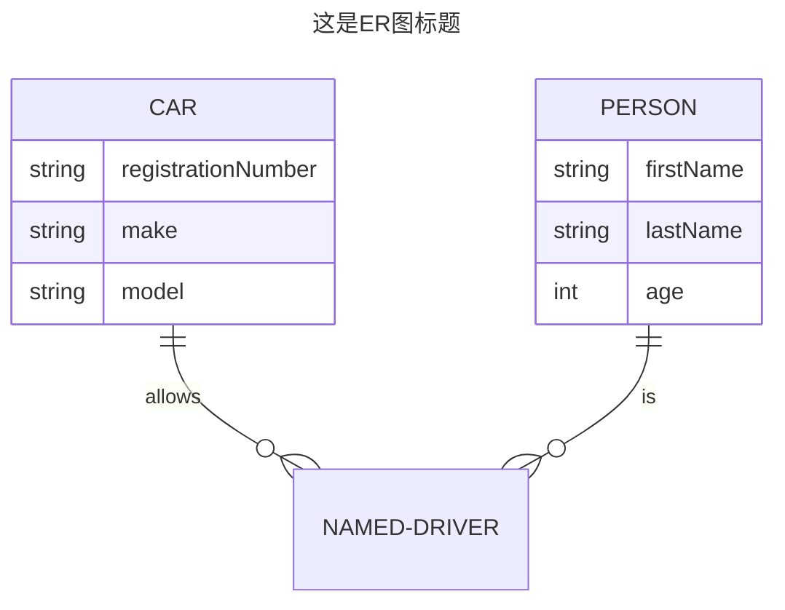
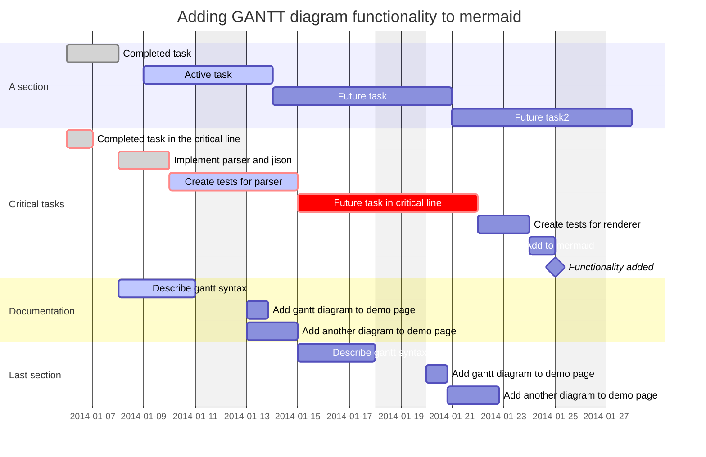
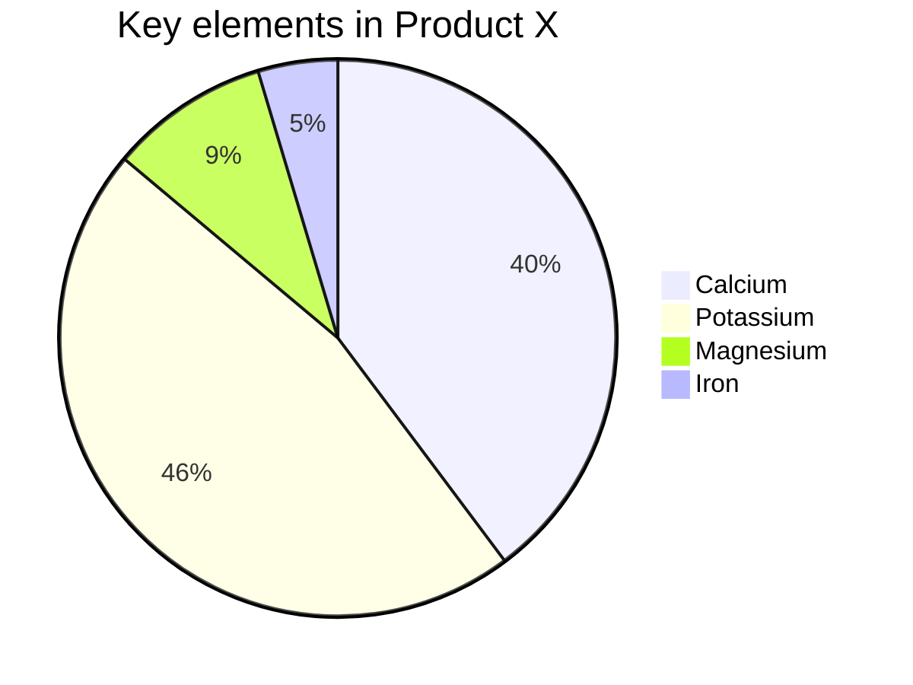

## [ER图](https://mermaid.js.org/syntax/entityRelationshipDiagram.html)

ER图关键字`erDiagram`，E-R图也称实体-联系图(Entity Relationship Diagram)，提供了表示实体类型、属性和联系的方法，用来描述现实世界的概念模型。

### 关系

| 左值                        | 右值                        | 含义     |
|:--------------------------|:--------------------------|:-------|
| <code>&#124;o</code>      | <code>o&#124;</code>      | 0个或1个  |
| <code>&#124;&#124;</code> | <code>&#124;&#124;</code> | 有且仅有1个 |
| `}o`                      | `o{`                      | 0个或多个  |
| <code>}&#124;</code>      | <code>&#124;{</code>      | 1个或多个  |

### 示例

<table>
<tr>
<td width="40%">

```mmd
---
title: 这是ER图标题
---
erDiagram
    CAR ||--o{ NAMED-DRIVER : allows
    CAR {
        string registrationNumber
        string make
        string model
    }
    PERSON ||--o{ NAMED-DRIVER : is
    PERSON {
        string firstName
        string lastName
        int age
    }
```

</td>
<td>



</td>
</tr>
</table>

## [甘特图](https://mermaid.js.org/syntax/gantt.html)

甘特图关键字`gantt`，每项任务描述有5个配置，其含义如下

| 位置  | 含义     | 可选值                                  |
|:----|:-------|:-------------------------------------|
| 1   | 是否关键   | `crit/缺省`，crit会展示为红色                 |
| 2   | 状态     | `done/active/缺省`，完成灰色/激活为蓝色          |
| 3   | 别名     | `给定别名/缺省`任务别名                        |
| 4   | 任务开始时间 | `YYYY-MM-DD/after 其他代号/缺省`           |
| 5   | 任务结束时间 | `YYYY-MM-DD/持续时长/缺省`，h表示小时，d表示天，w表示周 |

```mmd
gantt
    dateFormat  YYYY-MM-DD
    title       Adding GANTT diagram functionality to mermaid
    excludes    weekends
    %% (`excludes` accepts specific dates in YYYY-MM-DD format, days of the week ("sunday") or "weekends", but not the word "weekdays".)

    section A section
    Completed task            :done,    des1, 2014-01-06,2014-01-08
    Active task               :active,  des2, 2014-01-09, 3d
    Future task               :         des3, after des2, 5d
    Future task2              :         des4, after des3, 5d

    section Critical tasks
    Completed task in the critical line :crit, done, 2014-01-06,24h
    Implement parser and jison          :crit, done, after des1, 2d
    Create tests for parser             :crit, active, 3d
    Future task in critical line        :crit, 5d
    Create tests for renderer           :2d
    Add to mermaid                      :1d
    Functionality added                 :milestone, 2014-01-25, 0d

    section Documentation
    Describe gantt syntax               :active, a1, after des1, 3d
    Add gantt diagram to demo page      :after a1  , 20h
    Add another diagram to demo page    :doc1, after a1  , 48h

    section Last section
    Describe gantt syntax               :after doc1, 3d
    Add gantt diagram to demo page      :20h
    Add another diagram to demo page    :48h
```



## [饼图](https://mermaid.js.org/syntax/pie.html)

饼图关键字`pie`

```mmd
pie
    title Key elements in Product X
    "Calcium" : 42.96
    "Potassium" : 50.05
    "Magnesium" : 10.01
    "Iron" :  5
```



## [时间轴图](https://mermaid.js.org/syntax/timeline.html)

时间轴图关键字`timeline`

title定义图标题，可以没有

事件定义格式如下

```js
// 单事件
time : event

// 多事件
time : event1
     : event2
     : event3

// 多事件
time : event1 : event2 : event3
```

- 简单示例

    ```mmd
    timeline
        title History of Social Media Platform
        2002 : LinkedIn
        2004 : Facebook : Google
        2005 : Youtube
        2006 : Twitter
    ```
    
    ```mermaid
    timeline
        title History of Social Media Platform
        2002 : LinkedIn
        2004 : Facebook : Google
        2005 : Youtube
        2006 : Twitter
    ```

- 带分组

    ```mmd
    timeline
            title England's History Timeline
            section Stone Age
              7600 BC : Britain's oldest known house was built in Orkney, Scotland
              6000 BC : Sea levels rise and Britain becomes an island.<br> The people who live here are hunter-gatherers.
            section Bronze Age
              2300 BC : People arrive from Europe and settle in Britain. <br>They bring farming and metalworking.
                      : New styles of pottery and ways of burying the dead appear.
              2200 BC : The last major building works are completed at Stonehenge.<br> People now bury their dead in stone circles.
                      : The first metal objects are made in Britain.Some other nice things happen. it is a good time to be alive.
    ```
    
    ```mermaid
    timeline
            title England's History Timeline
            section Stone Age
              7600 BC : Britain's oldest known house was built in Orkney, Scotland
              6000 BC : Sea levels rise and Britain becomes an island.<br> The people who live here are hunter-gatherers.
            section Bronze Age
              2300 BC : People arrive from Europe and settle in Britain. <br>They bring farming and metalworking.
                      : New styles of pottery and ways of burying the dead appear.
              2200 BC : The last major building works are completed at Stonehenge.<br> People now bury their dead in stone circles.
                      : The first metal objects are made in Britain.Some other nice things happen. it is a good time to be alive.
    ```
