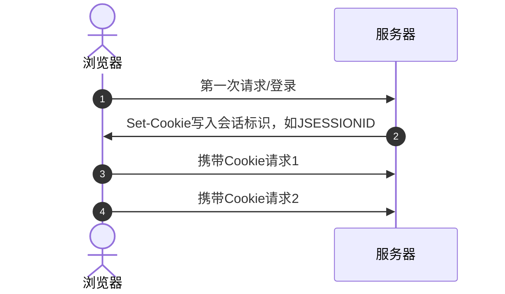
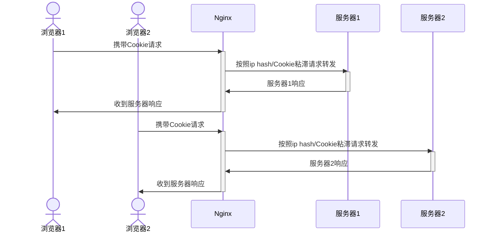
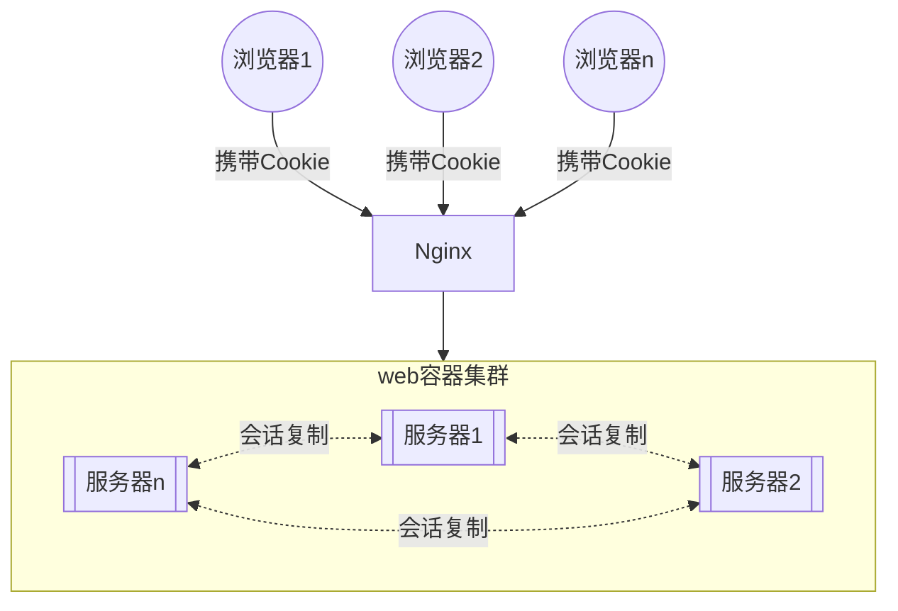
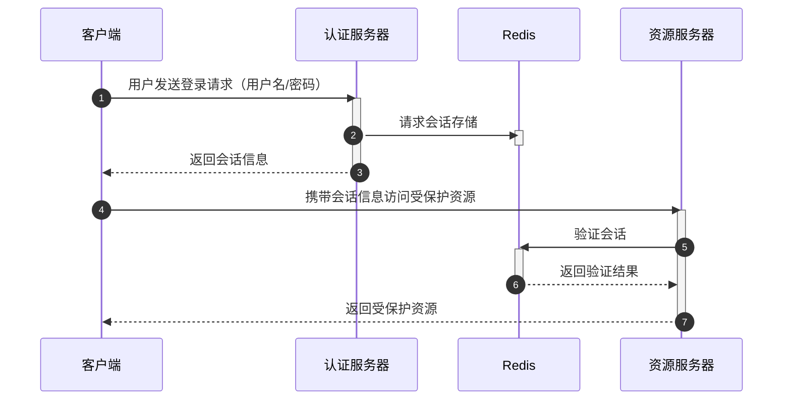
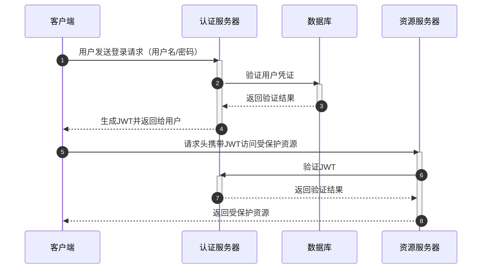
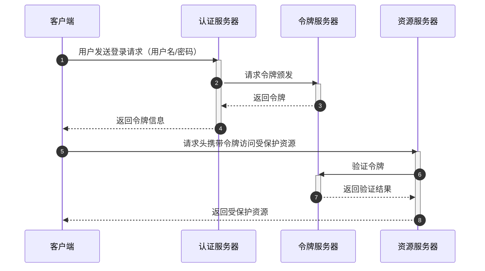

## 会话存储方式

基于浏览器存储的会话管理利用现代浏览器提供的各种存储选项来管理用户会话。通过这些方法，可以在客户端环境中存储和管理会话信息，支持跨页面和跨会话的用户交互。

### Cookie

在Web早期（1990年代中期），HTTP协议被设计为无状态协议，这意味着每次请求都是独立的，服务器无法识别连续的请求是否来自同一个用户。
为了实现状态管理，Netscape公司在1994年引入了Cookie技术。Cookie允许服务器在客户端存储小块数据，使得每次请求都可以携带这些数据，从而实现会话管理和状态保持。

::: warning 存在的问题
- 安全性问题，Cookie以明文存储，容易被篡改和攻击（除非使用HTTPS和设置HttpOnly属性），如`XXS`、`CSRF`
- 存储限制，同一个域最多50条且不能超过4KB
- 可被禁用，用户可以禁用或删除浏览器中的Cookie，会直接影响那些依赖于Cookie的站点功能
- 不支持跨域
- 带宽占用，Cookies会在每次HTTP请求中发送，增加了带宽消耗，特别是在大量请求时
:::

### SessionStorage

随着Web应用的复杂化，开发者需要一种机制来在单个会话（即浏览器标签页或窗口）中存储数据，但在关闭标签页或窗口后自动清除这些数据。
SessionStorage是在HTML5规范中引入的，目的是提供一个临时存储数据的解决方案，解决了使用Cookie可能带来的安全问题和存储限制。

::: warning 存在的问题
- 仅当前会话有效，数据在标签页或窗口关闭后会被清除，不适合需要跨会话保存的数据
- 安全性问题，容易受到XSS攻击，因为JavaScript代码可以直接访问sessionStorage数据
- 仅客户端可访问，服务器无法直接访问sessionStorage数据，限制了其在某些场景下的使用
- 同步阻塞，sessionStorage的操作是同步的，可能导致性能问题，尤其是在大量读写操作时
- 兼容性问题，尽管现代浏览器支持良好，但在某些老版本浏览器中可能不支持
:::

### LocalStorage

随着Web应用的发展，开发者需要在客户端长期存储更多的数据，例如用户设置、偏好等。LocalStorage同样是在HTML5规范中引入的，
旨在提供一个持久化的客户端存储解决方案，比Cookie的存储容量更大且不会随浏览器关闭而删除。

::: warning 存在的问题
- 安全性问题，容易受到XSS攻击，因为JavaScript代码可以直接访问localStorage数据
- 仅客户端可访问，服务器无法直接访问localStorage数据，限制了其在某些场景下的使用
- 同步阻塞，localStorage的操作是同步的，可能导致性能问题，尤其是在大量读写操作时
- 兼容性问题，尽管现代浏览器支持良好，但在某些老版本浏览器中可能不支持
:::

### IndexedDB

现代Web应用需要处理更复杂的数据结构和更大量的数据存储需求，如离线数据、复杂查询等。IndexedDB是一个低级别的API，允许开发者在客户端存储和检索大量结构化数据。
它是在HTML5规范的一部分引入的，目的是提供一个功能强大且灵活的客户端数据库解决方案，支持事务、索引和查询等高级功能。

::: warning 存在的问题
- 复杂性高，操作相对复杂，API使用需要较高的学习成本
- 兼容性问题，尽管现代浏览器支持良好，但在某些老版本浏览器中可能不支持
:::

### 存储方式对比

| 存储方式      | Cookie        | SessionStorage | LocalStorage | IndexedDB     |
|-----------|---------------|----------------|--------------|---------------|
| **大小限制**  | 通常为4KB-20KB   | 通常5MB或更大       | 通常5MB或更大     | 几乎无限制，依赖于磁盘空间 |
| **兼容性**   | 所有现代浏览器及旧版浏览器 | 所有现代浏览器        | 所有现代浏览器      | 所有现代浏览器       |
| **窗口限制**  | 跨窗口共享         | 仅限当前窗口或标签页     | 跨窗口共享        | 跨窗口共享         |
| **有效期**   | 可设置过期时间       | 当前会话结束时删除      | 永久，除非手动删除    | 永久，除非手动删除     |
| **存储位置**  | 客户端和服务器端      | 客户端            | 客户端          | 客户端           |
| **发送方式**  | 每次请求自动发送给服务器  | 不自动发送          | 不自动发送        | 不自动发送         |
| **语法复杂度** | 简单，基于字符串存储    | 简单，基于字符串存储     | 简单，基于字符串存储   | 复杂，基于对象存储     |

## 会话发展历程

### 无会话管理

早期的Web应用是无状态的，每个HTTP请求都是独立的，没有内在的状态。由于没有专门的会话管理机制，用户每次请求都需要传递所有必要的数据。
比如，当前的博客实现，就是一个纯展示型的web应用。


### 单体Web容器Session会话

一个服务端存储所有会话信息，由于将所有应用都部署在单个服务器节点上，随着应用的不断迭代开发，单体应用将会发展成巨石应用，臃肿不堪，难以维护。



::: tip 优点
- 实现简单
- 易于管理和控制会话
- 灵活度高
:::

::: danger 缺点
- 不支持跨域
- 无持久化，服务宕机或重启，会话信息丢失
- 存储开销，会话数据的存储会占用较多的内存和存储空间
- 扩展限制，会话数据存储在单个服务器上，无法水平扩展
:::

### 基于Nginx实现会话一致性

当单体不足以支持用户访问量时，需要水平扩展服务，但是服务又是独立存储会话信息，使用Nginx做负载均衡时没法保证会话的一致，
会存在A服务生成的会话在B服务找不到的问题，可以使用Nginx的会话粘滞或ip哈希实现会话一致性。



::: tip 优点
- 一定程度满足扩展性要求
- 一定程度减轻会话存储压力
:::

::: danger 缺点
- 不支持跨域
- 无持久化，服务宕机或重启，宕机服务器会话信息丢失
- 哈希或会话粘滞可能会存在分配不均，导致某一台服务器压力过大
:::

#### sticky指令

基于Nginx的upstream模块的[sticky指令](https://nginx.org/en/docs/http/ngx_http_upstream_module.html#sticky)实现会话粘滞
    
```nginx
http {
    upstream backend {
        # 设置会话粘滞的Cookie标识 默认为route
        sticky cookie srv_id expires=1h domain=.example.com path=/; # [!code error]
        server backend1.example.com;
        server backend2.example.com;
        server backend3.example.com;
    }

    server {
        # 省略其他配置
        location / {
            proxy_pass http://backend;
        }
    }
}
```
::: warning 注意
基于Cookie实现，需要浏览器支持或启用Cookie，且Cookie名称不要与业务上的Cookie名称相同，会被覆盖
:::

#### ip_hash指令

基于Nginx的upstream模块的[ip_hash指令](https://nginx.org/en/docs/http/ngx_http_upstream_module.html#ip_hash)实现

```nginx
http {
    upstream backend {
        # 按照客户端ip hash
        ip_hash; # [!code error]
        server backend1.example.com;
        server backend2.example.com down; # [!code error]
        server backend3.example.com;
    }

    server {
        # 省略其他配置
        location / {
            proxy_pass http://backend;
        }
    }
}
```
::: warning 注意
当某个服务宕机后不能直接删除upstream中的server，会导致nginx的hash重新分配，只能将某台标识为`down`
:::

### Web容器集群会话复制

大多数Web容器支持会话复制，多个容器节点之间通过RPC技术复制会话，旨在当某一个容器出现故障时，用户会话能转移到
其他容器节点继续存在，从而提供无缝的用户体验，无需用户重新登录或者提交会话数据。



::: tip 优点
- 提高可靠性，通过在多个实例之间复制会话数据，避免了单点故障，提升了系统的可靠性和可用性
- 无缝用户体验，用户不会因为单个Tomcat实例的故障而丢失会话数据，继续保持当前的操作状态
- 支持负载均衡，会话复制与负载均衡结合使用，可以有效地分配用户请求，优化资源利用率
- 简化集群管理，使得集群管理更加简单，因为所有实例都共享会话状态，不需要复杂的会话管理逻辑
:::

::: danger 缺点
- 不支持跨域
- 无持久化，服务宕机或重启，宕机服务器会话信息丢失
- 性能开销，会话复制会增加网络通信开销，会话数据量越多、用户并发越高，对服务器性能影响越显著
- 复杂性增加，需要额外配置和管理会话复制机制，增加了系统的复杂性
- 数据一致性问题，会话数据在复制过程中发生变化，可能会出现数据一致性问题，导致用户看到不一致的数据
- 扩展性限制，当集群规模扩大时，复制的开销会增加，可能会限制系统的扩展性
:::

#### Tomcat集群会话复制

::: code-group
```nginx[nginx.conf]
http {
    upstream backend {
        server backend1.example.com;
        server backend2.example.com;
        server backend3.example.com;
    }

    server {
        # 省略其他配置
        location / {
            proxy_pass http://backend;
        }
    }
}
```

```xml[server.xml]
<Cluster className="org.apache.catalina.ha.tcp.SimpleTcpCluster"
                 channelSendOptions="8">

  <Manager className="org.apache.catalina.ha.session.DeltaManager"
           expireSessionsOnShutdown="false"
           notifyListenersOnReplication="true"/>

  <Channel className="org.apache.catalina.tribes.group.GroupChannel">
    <Membership className="org.apache.catalina.tribes.membership.McastService"
                address="228.0.0.4"
                port="45564"
                frequency="500"
                dropTime="3000"/>
    <Receiver className="org.apache.catalina.tribes.transport.nio.NioReceiver"
              address="auto"
              port="4000"
              autoBind="100"
              selectorTimeout="5000"
              maxThreads="6"/>

    <Sender className="org.apache.catalina.tribes.transport.ReplicationTransmitter">
      <Transport className="org.apache.catalina.tribes.transport.nio.PooledParallelSender"/>
    </Sender>
    <Interceptor className="org.apache.catalina.tribes.group.interceptors.TcpFailureDetector"/>
    <Interceptor className="org.apache.catalina.tribes.group.interceptors.MessageDispatch15Interceptor"/>
  </Channel>

  <Valve className="org.apache.catalina.ha.tcp.ReplicationValve"
         filter=""/>
  <Valve className="org.apache.catalina.ha.session.JvmRouteBinderValve"/>

  <Deployer className="org.apache.catalina.ha.deploy.FarmWarDeployer"
            tempDir="/tmp/war-temp/"
            deployDir="/tmp/war-deploy/"
            watchDir="/tmp/war-listen/"
            watchEnabled="false"/>

  <ClusterListener className="org.apache.catalina.ha.session.ClusterSessionListener"/>
</Cluster>
```
:::

::: warning Tomcat集群会话复制注意点
- 所有的会话属性必须实现 java.io.Serializable
- 确保`web.xml`含有`<distributable/>`属性
- 所有节点必须具有相同的时间，并且与NTP服务器同步
- 如果多个Tomcat实例都运行在同一台机器上，则要确保每个实例都具有唯一的tcpListenPort
:::

### 集中会话管理

在前面提到的Web容器会话复制或Nginx会话粘滞，每当其中一台服务器宕机时，会导致丢失一台服务器的会话。为了提供更好的用户体验，
系统需要保证高可用性和负载均衡，这意味着用户的请求可能被分配到不同的服务器处理，分布式系统和微服务架构应运而生，将应用程序拆分为多个独立的服务，
每个服务可以独立部署和扩展。将会话信息集中存储在数据库、[Memcache](https://memcached.org/)、[Redis](https://redis.io/)中，使得会话信息可以在
所有服务中共享。



::: tip 优点
- 一致性，在多个应用服务器之间共享会话数据，保证了用户在不同服务器之间切换时的会话一致性
- 高可用性，通过集中的会话存储，可以实现会话数据的冗余和备份，提高系统的高可用性
- 扩展性，通过扩展分布式存储即可，应用服务器无需担心同步问题
- 负载均衡，由于会话数据集中管理，可以实现无状态的负载均衡（Stateless Load Balancing），使得负载均衡器可以自由地将请求分发到任何一台应用服务器
- 简化运维，会话数据集中存储简化了集群管理和运维工作，不需要在各个服务器之间同步会话数据
:::

::: warning 缺点
- 单点故障风险，集中化的存储系统可能成为单点故障（Single Point of Failure），如果集中存储系统出现问题，整个系统的会话管理将受到影响，可以通过冗余和高可用性设计来缓解这个问题
- 性能瓶颈，集中存储系统可能成为性能瓶颈，特别是在高并发环境下，需要设计高性能的存储系统（如使用Redis、Memcached等）来承载会话数据的读写压力
- 复杂性增加，集中会话管理引入了或实现了一个可靠的集中存储系统，并处理会话数据的持久化和缓存失效等问题
- 安全性问题，会话数据集中存储需要考虑安全性问题，防止会话数据泄漏或被篡改，需要在传输和存储时加密会话数据
:::

### JWT（去中心化）

JWT（JSON Web Token），是一种用于在网络应用之间安全地传输信息的开放标准（[RFC 7519](https://datatracker.ietf.org/doc/html/rfc7519)）。
它采用了一种紧凑的、自包含的方式来表示信息，通常用于身份验证和授权。JWT的设计目标是确保信息的完整性和安全性，同时具备易于使用和传输的特点。

JWT包含Header、Payload、Signature三部分，以`.`拼接。

- Header：包含令牌类型、签名算法，一般会base64编码
- Payload：包含令牌发行者、主题、受众、过期时间、生效时间、唯一标识符及自定义数据，一般也为base64编码
- Signature：签名为Header+Payload+密钥做的哈希，签名验证Hash(Header+Payload)为令牌的签名表示未被篡改



::: tip 优点
- 无状态：JWT本身包含了认证/授权所必要的信息，无需服务器额外维护会话状态（即去中心化）
- 扩展性：Payload可以自定义数据，按需添加额外数据
- 安全性高：签名校验机制保证令牌本身不能被篡改，使用合适的签名算法即可
:::

::: danger 缺点
- 数据暴露：Payload数据并未加密，任何人都可以读取到这部分数据
- 无法轻易撤销：一旦令牌发行，除非修改签名算法或密钥（这会导致所有令牌失效），无法撤销令牌
- 无法轻易修改：一旦令牌发行，无法修改Payload部分数据（这会导致签名不一样且令牌也不一样），只能重新发行新的令牌
- 令牌过期时间问题：管理令牌过期时间会比较复杂，短时间过期需要频繁刷新，长时间过期会增加安全风险
- 令牌长度问题：Payload本身是base64编码的，数据越多会导致令牌越长
:::

### Token

服务器在验证帐号、密码通过后，会把用户id、会话到期时间等信息绑定到/加密成一个令牌上，生成一个不透明字符串，将这个不透明字符串（称为token）作为登录凭证。
通过HTTP约定，将令牌以某种方式返回给客户端，客户端将Token保存到本地。

客户端在每次发起请求时，需要携带token（如以Header方式）传递到服务端，服务端解密或校验通过与否判断是否需要重新认证，相比[集中会话机制](#集中会话管理){rel="noreferrer"}中使用的会话id而言，
服务端对令牌做过数字签名，客户端一般不能猜测或篡改令牌。



::: tip 优点
- 安全性高，Token通常存储在服务器端数据库中，客户端只保存Token的唯一标识符。这种机制下，Token内容不会暴露在客户端，减少了Token被篡改的风险
- 可控性强，服务器端可以随时撤销或更新Token或动态调整Token权限，有效控制会话的有效期和权限
- 减少传输数据量，由于Token只是一个唯一标识符，相比JWT携带的完整用户信息，传输的数据量更小，减少了带宽消耗
- 跨域和跨平台支持，令牌可以在不同的域和平台之间传递，适合微服务和跨平台应用场景
:::

::: danger 缺点
- 服务器压力大，Token的验证和会话管理全部依赖服务器端，随着用户数量和请求量增加，服务器负载会显著增加
- 复杂度较高，为了保证会话的可用性，服务器端需要实现高可用和分布式的存储方案，增加了系统复杂性
:::
