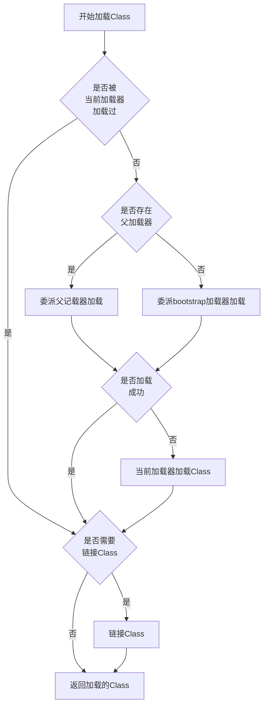
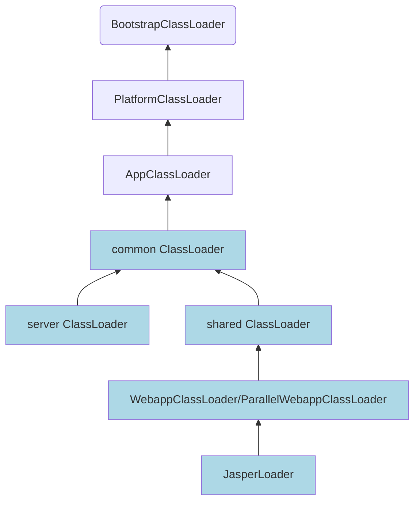

## 什么是双亲委派模型？

::: tip  
如果一个类收到一个处理请求，他先判断请求是否已经被自己处理过，如果没有则将请求委派给父级处理，
当且仅当父级不存在或者无法处理时，当前这个类才会处理请求，从而避免了重复处理。
:::

其实双亲委派模型本质上就是设计模式的[责任链模式](https://www.xiehai.zone/DesignPatterns/behavioural/2-1-chain-of-responsibility.html)，
只是链有一定的顺序，且不能被打乱。

## 为什么叫双亲委派模型？

双亲委派模型(**Parents Delegation Model**)，`parent`直译是父亲或者母亲，`parents`直译就是双亲、父母，
这应该就是双亲委派模型的由来。

就个人而言，我觉得`parents`翻译为`双亲`不够贴切，或者说`双`字会给人误解(我一开始就误解了，没找到这个双在哪里，ClassLoader就定义了一个parent)，这里的`parents`应该是所有parent的意思，
即，父级、父级的父级、父级的父级的父级……  
如果翻译为`父级委派模型`或者`父系委派模型`，我觉得更容易让人理解。

## Java的类加载器

- JDK8 ClassLoader双亲委派模型

    ```mermaid
    flowchart BT
    C1[用户自定义ClassLoader1]:::custom --> C[AppClassLoader]
    C2[用户自定义ClassLoader2]:::custom --> C
    C --> B[ExtClassLoader]
    B --> A("BootstrapClassLoader(C++实现)")
    classDef custom fill:silver
    click B "https://github.com/openjdk/jdk/blob/jdk8-b120/jdk/src/share/classes/sun/misc/Launcher.java#L122-L253" _blank
    click C "https://github.com/openjdk/jdk/blob/jdk8-b120/jdk/src/share/classes/sun/misc/Launcher.java#L259-L484" _blank
    ```
- JDK9以后ClassLoader双亲委派模型

    ```mermaid
    flowchart BT
    C1[用户自定义ClassLoader1]:::custom --> C[AppClassLoader]
    C2[用户自定义ClassLoader2]:::custom --> C
    C --> B[PlatformClassLoader]
    B --> A("BootstrapClassLoader(Java实现)")
    classDef custom fill:silver
    click A "https://github.com/openjdk/jdk/blob/jdk-9%2B181/jdk/src/java.base/share/classes/jdk/internal/loader/ClassLoaders.java#L118-L127" _blank
    click B "https://github.com/openjdk/jdk/blob/jdk-9%2B181/jdk/src/java.base/share/classes/jdk/internal/loader/ClassLoaders.java#L133-L152" _blank
    click C "https://github.com/openjdk/jdk/blob/jdk-9%2B181/jdk/src/java.base/share/classes/jdk/internal/loader/ClassLoaders.java#L158-L220" _blank
    ```

- ClassLoader核心方法

    | 方法名                      | 作用                                                                                                                                                                                                                                                                                                                                                             |
    |:-------------------------|:---------------------------------------------------------------------------------------------------------------------------------------------------------------------------------------------------------------------------------------------------------------------------------------------------------------------------------------------------------------|
    | defineClass              | 将字节数组解析为Class对象                                                                                                                                                                                                                                                                                                                                                |
    | findClass                | 需要子类实现，当父加载器无法加载Class时，当前加载器的加载实现，通常和defineClass一起使用                                                                                                                                                                                                                                                                                                           |
    | loadClass                | 加载类的核心方法，也是双亲委派模型的体现                                                                                                                                                                                                                                                                                                                                           |
    | resolveClass             | 链接Class，注释上这么写的，实际可能没有做任何处理，[JDK8](https://github.com/openjdk/jdk/blob/jdk8-b120/jdk/src/share/classes/java/lang/ClassLoader.java#L960-L964)调用了native方法，[JDK9](https://github.com/openjdk/jdk/blob/801281100cbbec62d41c643ee4d79537a8e8992c/jdk/src/java.base/share/classes/java/lang/ClassLoader.java#L1207-L1211)只有一个空判断 |
    | findLoadedClass          | 查找已经被当前ClassLoader加载的Class                                                                                                                                                                                                                                                                                                                                     |
    | findBootstrapClassOrNull | 查找被BootstrapClassLoader加载的Class                                                                                                                                                                                                                                                                                                                                |

在Java中，一个类加载器加载一个类时，除非显示的使用另一个类加载器，否则该类所依赖或者引用的其他类也将由该类加载器加载。

::: warning 关于ClassLoader的父级

这里的父级不是继承关系，ClassLoader里面的parent其实是组合关系并非继承，
在针对ClassLoader的父级是指**parent**加载器而非~~super~~，当parent为`null`时，则父加载器为BootstrapClassLoader。

:::

### 不同ClassLoader各自负责加载哪些类呢？

#### JDK8加载器加载情况

::: details 代码示例
~~~java
public class Main {
    public static void main(String[] args) {
        // 负责加载jre下的rt、charsets等核心包
        System.out.println("BootstrapClassLoader加载的路径");
        System.out.println(Arrays.toString(Launcher.getBootstrapClassPath().getURLs()));
        URLClassLoader appClassLoader = (URLClassLoader) Launcher.getLauncher().getClassLoader();
        URLClassLoader extClassLoader = (URLClassLoader) appClassLoader.getParent();
        // 负责加载jre/lib/ext目录下的包
        System.out.println("ExtClassLoader加载的路径");
        System.out.println(Arrays.toString(extClassLoader.getURLs()));
        // 负责加载jie剩余包及classpath下的包    
        System.out.println("AppClassLoader加载的路径");
        System.out.println(Arrays.toString(appClassLoader.getURLs()));
    }
}
~~~

结果输出

~~~console
BootstrapClassLoader加载的路径
[file:/D:/tools/JDK8/jre/lib/resources.jar, file:/D:/tools/JDK8/jre/lib/rt.jar, file:/D:/tools/JDK8/jre/lib/sunrsasign.jar, file:/D:/tools/JDK8/jre/lib/jsse.jar, file:/D:/tools/JDK8/jre/lib/jce.jar, file:/D:/tools/JDK8/jre/lib/charsets.jar, file:/D:/tools/JDK8/jre/lib/jfr.jar, file:/D:/tools/JDK8/jre/classes]
ExtClassLoader加载的路径
[file:/D:/tools/JDK8/jre/lib/ext/access-bridge-64.jar, file:/D:/tools/JDK8/jre/lib/ext/cldrdata.jar, file:/D:/tools/JDK8/jre/lib/ext/dnsns.jar, file:/D:/tools/JDK8/jre/lib/ext/jaccess.jar, file:/D:/tools/JDK8/jre/lib/ext/jfxrt.jar, file:/D:/tools/JDK8/jre/lib/ext/localedata.jar, file:/D:/tools/JDK8/jre/lib/ext/nashorn.jar, file:/D:/tools/JDK8/jre/lib/ext/PAD.JavaBridge.jar, file:/D:/tools/JDK8/jre/lib/ext/sunec.jar, file:/D:/tools/JDK8/jre/lib/ext/sunjce_provider.jar, file:/D:/tools/JDK8/jre/lib/ext/sunmscapi.jar, file:/D:/tools/JDK8/jre/lib/ext/sunpkcs11.jar, file:/D:/tools/JDK8/jre/lib/ext/zipfs.jar]
AppClassLoader加载的路径
[file:/D:/tools/JDK8/jre/lib/charsets.jar, file:/D:/tools/JDK8/jre/lib/deploy.jar, file:/D:/tools/JDK8/jre/lib/ext/access-bridge-64.jar, file:/D:/tools/JDK8/jre/lib/ext/cldrdata.jar, file:/D:/tools/JDK8/jre/lib/ext/dnsns.jar, file:/D:/tools/JDK8/jre/lib/ext/jaccess.jar, file:/D:/tools/JDK8/jre/lib/ext/jfxrt.jar, file:/D:/tools/JDK8/jre/lib/ext/localedata.jar, file:/D:/tools/JDK8/jre/lib/ext/nashorn.jar, file:/D:/tools/JDK8/jre/lib/ext/sunec.jar, file:/D:/tools/JDK8/jre/lib/ext/sunjce_provider.jar, file:/D:/tools/JDK8/jre/lib/ext/sunmscapi.jar, file:/D:/tools/JDK8/jre/lib/ext/sunpkcs11.jar, file:/D:/tools/JDK8/jre/lib/ext/zipfs.jar, file:/D:/tools/JDK8/jre/lib/javaws.jar, file:/D:/tools/JDK8/jre/lib/jce.jar, file:/D:/tools/JDK8/jre/lib/jfr.jar, file:/D:/tools/JDK8/jre/lib/jfxswt.jar, file:/D:/tools/JDK8/jre/lib/jsse.jar, file:/D:/tools/JDK8/jre/lib/management-agent.jar, file:/D:/tools/JDK8/jre/lib/plugin.jar, file:/D:/tools/JDK8/jre/lib/resources.jar, file:/D:/tools/JDK8/jre/lib/rt.jar, file:/D:/scm/temp/test/test/target/classes/, file:/C:/Program%20Files/JetBrains/IntelliJ%20IDEA%202022.3.1/lib/idea_rt.jar]
~~~

:::

#### JDK9加载器[加载模块情况](https://openjdk.org/jeps/261)

::: details 代码示例
代码运行需要添加`--add-opens=java.base/jdk.internal.loader=ALL-UNNAMED`vm参数

~~~java
public class Main {
    public static void main(String[] args) throws NoSuchFieldException, IllegalAccessException, ClassNotFoundException {
        Field field = Class.forName("jdk.internal.loader.ClassLoaders").getDeclaredField("BOOT_LOADER");
        field.setAccessible(true);
        ClassLoader appClassLoader = ClassLoader.getSystemClassLoader(),
            platformClassLoader = appClassLoader.getParent(),
            bootstrapClassLoader = (ClassLoader) field.get(null);

        Field nameToModule = appClassLoader.getClass().getSuperclass().getDeclaredField("nameToModule");
        nameToModule.setAccessible(true);
        System.out.println("BootClassLoader加载的模块");
        System.out.println(nameToModule.get(bootstrapClassLoader));
        System.out.println("PlatformClassLoader加载的模块");
        System.out.println(nameToModule.get(platformClassLoader));
        System.out.println("AppClassLoader加载的模块");
        System.out.println(nameToModule.get(appClassLoader));
    }
}
~~~

结果输出

~~~console
BootClassLoader加载的模块
{jdk.management.jfr=[module jdk.management.jfr, location=jrt:/jdk.management.jfr], java.rmi=[module java.rmi, location=jrt:/java.rmi], java.logging=[module java.logging, location=jrt:/java.logging], java.xml=[module java.xml, location=jrt:/java.xml], jdk.jfr=[module jdk.jfr, location=jrt:/jdk.jfr], java.datatransfer=[module java.datatransfer, location=jrt:/java.datatransfer], jdk.httpserver=[module jdk.httpserver, location=jrt:/jdk.httpserver], jdk.net=[module jdk.net, location=jrt:/jdk.net], java.naming=[module java.naming, location=jrt:/java.naming], java.desktop=[module java.desktop, location=jrt:/java.desktop], jdk.management.resource=[module jdk.management.resource, location=jrt:/jdk.management.resource], java.prefs=[module java.prefs, location=jrt:/java.prefs], jdk.naming.rmi=[module jdk.naming.rmi, location=jrt:/jdk.naming.rmi], jdk.snmp=[module jdk.snmp, location=jrt:/jdk.snmp], java.security.sasl=[module java.security.sasl, location=jrt:/java.security.sasl], jdk.management.cmm=[module jdk.management.cmm, location=jrt:/jdk.management.cmm], java.base=[module java.base, location=jrt:/java.base], jdk.management.agent=[module jdk.management.agent, location=jrt:/jdk.management.agent], java.management=[module java.management, location=jrt:/java.management], jdk.sctp=[module jdk.sctp, location=jrt:/jdk.sctp], jdk.unsupported=[module jdk.unsupported, location=jrt:/jdk.unsupported], java.instrument=[module java.instrument, location=jrt:/java.instrument], jdk.management=[module jdk.management, location=jrt:/jdk.management], java.management.rmi=[module java.management.rmi, location=jrt:/java.management.rmi]}
PlatformClassLoader加载的模块
{java.sql=[module java.sql, location=jrt:/java.sql], javafx.web=[module javafx.web, location=jrt:/javafx.web], jdk.charsets=[module jdk.charsets, location=jrt:/jdk.charsets], java.xml.crypto=[module java.xml.crypto, location=jrt:/java.xml.crypto], jdk.xml.dom=[module jdk.xml.dom, location=jrt:/jdk.xml.dom], jdk.javaws=[module jdk.javaws, location=jrt:/jdk.javaws], jdk.deploy=[module jdk.deploy, location=jrt:/jdk.deploy], javafx.base=[module javafx.base, location=jrt:/javafx.base], jdk.crypto.cryptoki=[module jdk.crypto.cryptoki, location=jrt:/jdk.crypto.cryptoki], java.jnlp=[module java.jnlp, location=jrt:/java.jnlp], javafx.controls=[module javafx.controls, location=jrt:/javafx.controls], java.se=[module java.se, location=jrt:/java.se], jdk.zipfs=[module jdk.zipfs, location=jrt:/jdk.zipfs], jdk.plugin.dom=[module jdk.plugin.dom, location=jrt:/jdk.plugin.dom], jdk.crypto.ec=[module jdk.crypto.ec, location=jrt:/jdk.crypto.ec], jdk.crypto.mscapi=[module jdk.crypto.mscapi, location=jrt:/jdk.crypto.mscapi], java.sql.rowset=[module java.sql.rowset, location=jrt:/java.sql.rowset], jdk.jsobject=[module jdk.jsobject, location=jrt:/jdk.jsobject], javafx.swing=[module javafx.swing, location=jrt:/javafx.swing], oracle.desktop=[module oracle.desktop, location=jrt:/oracle.desktop], java.smartcardio=[module java.smartcardio, location=jrt:/java.smartcardio], jdk.scripting.nashorn=[module jdk.scripting.nashorn, location=jrt:/jdk.scripting.nashorn], oracle.net=[module oracle.net, location=jrt:/oracle.net], java.security.jgss=[module java.security.jgss, location=jrt:/java.security.jgss], java.compiler=[module java.compiler, location=jrt:/java.compiler], jdk.security.auth=[module jdk.security.auth, location=jrt:/jdk.security.auth], javafx.graphics=[module javafx.graphics, location=jrt:/javafx.graphics], java.scripting=[module java.scripting, location=jrt:/java.scripting], javafx.fxml=[module javafx.fxml, location=jrt:/javafx.fxml], jdk.dynalink=[module jdk.dynalink, location=jrt:/jdk.dynalink], jdk.plugin=[module jdk.plugin, location=jrt:/jdk.plugin], jdk.accessibility=[module jdk.accessibility, location=jrt:/jdk.accessibility], javafx.media=[module javafx.media, location=jrt:/javafx.media], jdk.naming.dns=[module jdk.naming.dns, location=jrt:/jdk.naming.dns], jdk.security.jgss=[module jdk.security.jgss, location=jrt:/jdk.security.jgss], jdk.localedata=[module jdk.localedata, location=jrt:/jdk.localedata]}
AppClassLoader加载的模块
{jdk.javadoc=[module jdk.javadoc, location=jrt:/jdk.javadoc], jdk.jdi=[module jdk.jdi, location=jrt:/jdk.jdi], jdk.jshell=[module jdk.jshell, location=jrt:/jdk.jshell], jdk.editpad=[module jdk.editpad, location=jrt:/jdk.editpad], jdk.internal.le=[module jdk.internal.le, location=jrt:/jdk.internal.le], jdk.packager=[module jdk.packager, location=jrt:/jdk.packager], jdk.jlink=[module jdk.jlink, location=jrt:/jdk.jlink], jdk.jdwp.agent=[module jdk.jdwp.agent, location=jrt:/jdk.jdwp.agent], jdk.internal.jvmstat=[module jdk.internal.jvmstat, location=jrt:/jdk.internal.jvmstat], jdk.packager.services=[module jdk.packager.services, location=jrt:/jdk.packager.services], jdk.jstatd=[module jdk.jstatd, location=jrt:/jdk.jstatd], jdk.internal.ed=[module jdk.internal.ed, location=jrt:/jdk.internal.ed], jdk.jdeps=[module jdk.jdeps, location=jrt:/jdk.jdeps], jdk.compiler=[module jdk.compiler, location=jrt:/jdk.compiler], jdk.internal.opt=[module jdk.internal.opt, location=jrt:/jdk.internal.opt], jdk.jconsole=[module jdk.jconsole, location=jrt:/jdk.jconsole], jdk.jartool=[module jdk.jartool, location=jrt:/jdk.jartool], jdk.attach=[module jdk.attach, location=jrt:/jdk.attach]}
~~~

:::

### Java类加载机制

Java ClassLoader加载类流程如下，即[loadClass](https://github.com/openjdk/jdk/blob/801281100cbbec62d41c643ee4d79537a8e8992c/jdk/src/java.base/share/classes/java/lang/ClassLoader.java#L540-L576)方法流程。



按照双亲委派的定义，Java为了避免类的重复加载以及避免JDK核心开发库被覆盖使用了双亲委派来进行类的加载，自下而上委派，自上而下加载，
保证一个类在每个类加载器中都是同一个。

::: details 自定义java.lang.Object类
~~~java
package java.lang;

public class Object {
    public static void main(String[] args) {
        System.out.println("hello world!");
    }
}
~~~

运行结果

~~~console
错误: 在类 java.lang.Object 中找不到 main 方法, 请将 main 方法定义为:
   public static void main(String[] args)
否则 JavaFX 应用程序类必须扩展javafx.application.Application
~~~

:::

### 类的卸载

类装载后不能主动卸载，当达到以下条件后会由JVM卸载：

- 类的所有实例已被回收
- 类的类加载器已被回收
- 类的Class对象没被任何地方引用

## 打破双亲委派模

### 为什么要打破？

- 按照双亲委派机制，上层加载器是不能访问下层加载器加载的类，如Java的SPI机制
- 按照Java类加载机制，同一个类不能被加载多次
    - 某些应用环境隔离时，需要不同环境可以加载相同类，如Tomcat的web应用隔离、Arthas应用隔离
    - 热部署机制，某些时候不想重启服务，直接重新加载某个类，如应用热部署、springboot-dev-tools

### 如何打破？

- 中断责任链，让其不向上委派
- 支持一个类的重复加载
- 让父加载器可以看到子加载器加载的类

简单来说，有两种方法打破双亲委派，`自定义类装载器`或者`使用线程上线文类装载器`。

### 案例一 [Arthas](https://github.com/alibaba/arthas)应用隔离

按照前面类加载机制所讲的流程，要打破自定义的ClassLoader的双亲委派，只需重写`loadClass`方法，使其不向上委派即可。
Arthas的[agent](https://github.com/alibaba/arthas/blob/master/agent/src/main/java/com/taobao/arthas/agent/ArthasClassloader.java)和[attach agent](https://github.com/alibaba/arthas/blob/master/arthas-agent-attach/src/main/java/com/taobao/arthas/agent/attach/AttachArthasClassloader.java)通过重写loadClass方法实现类加载隔离。

::: details 代码示例
~~~java
public class ArthasClassloader extends URLClassLoader {
    public ArthasClassloader(URL[] urls) {
        super(urls, ClassLoader.getSystemClassLoader().getParent());
    }

    @Override
    protected synchronized Class<?> loadClass(String name, boolean resolve) throws ClassNotFoundException {
        final Class<?> loadedClass = findLoadedClass(name);
        if (loadedClass != null) {
            return loadedClass;
        }

        // 优先从parent（SystemClassLoader）里加载系统类，避免抛出ClassNotFoundException
        if (name != null && (name.startsWith("sun.") || name.startsWith("java."))) {
            return super.loadClass(name, resolve);
        }
        try {
            Class<?> aClass = findClass(name);
            if (resolve) {
                resolveClass(aClass);
            }
            return aClass;
        } catch (Exception e) {
            // ignore
        }
        return super.loadClass(name, resolve);
    }
}
~~~

:::

### 案例二 JDBC驱动加载

根据Java类加载原则，`一个类加载器加载一个类时，除非显示的使用另一个类加载器，否则该类所依赖或者引用的其他类也将由该类加载器加载`，Jdbc的Driver是由DriverManager
来加载实现类，DriverManager是由BootstrapClassLoader加载，Driver实现类由各服务商提供，按照类加载机制，会由AppClassLoader加载，
但是BootstrapClassLoader是AppClassLoader的父级，相当于父级要获取子级加载的类，这就打破了双亲委派。

自JDK1.2开始，引入了线程上下文类加载器，就是为了解决SPI类似的问题，提供商实现的Driver由线程上线文类加载器加载。
在JDK8中，DriverManager是静态块初始化加载，JDK9中使用的是懒加载，使用的时候才加载Driver，原理都是一样。

- [DriverManager](https://github.com/openjdk/jdk/blob/jdk8-b120/jdk/src/share/classes/java/sql/DriverManager.java#L567-L628)

    ```java
    public class DriverManager {
        static {
            // 初始化驱动过程
            loadInitialDrivers();
            println("JDBC DriverManager initialized");
        }
  
        // 省略其他方法
  
        private static void loadInitialDrivers() {
            String drivers;
            try {
                // 系统属性配置的jdbc驱动
                drivers = AccessController.doPrivileged(new PrivilegedAction<String>() {
                    public String run() {
                        return System.getProperty("jdbc.drivers");
                    }
                });
            } catch (Exception ex) {
                drivers = null;
            }
            // If the driver is packaged as a Service Provider, load it.
            // Get all the drivers through the classloader
            // exposed as a java.sql.Driver.class service.
            // ServiceLoader.load() replaces the sun.misc.Providers()
    
            // 加载SPI jdbc驱动
            AccessController.doPrivileged(new PrivilegedAction<Void>() {
                public Void run() {
                    // 通过spi获得驱动实现类 下面会说到SPI加载
                    ServiceLoader<Driver> loadedDrivers = ServiceLoader.load(Driver.class);
                    Iterator<Driver> driversIterator = loadedDrivers.iterator();
    
                    /* Load these drivers, so that they can be instantiated.
                     * It may be the case that the driver class may not be there
                     * i.e. there may be a packaged driver with the service class
                     * as implementation of java.sql.Driver but the actual class
                     * may be missing. In that case a java.util.ServiceConfigurationError
                     * will be thrown at runtime by the VM trying to locate
                     * and load the service.
                     *
                     * Adding a try catch block to catch those runtime errors
                     * if driver not available in classpath but it's
                     * packaged as service and that service is there in classpath.
                     */
                    try{
                        while(driversIterator.hasNext()) {
                            driversIterator.next();
                        }
                    } catch(Throwable t) {
                    // Do nothing
                    }
                    return null;
                }
            });
    
            println("DriverManager.initialize: jdbc.drivers = " + drivers);
    
            if (drivers == null || drivers.equals("")) {
                return;
            }
            String[] driversList = drivers.split(":");
            println("number of Drivers:" + driversList.length);
            for (String aDriver : driversList) {
                try {
                    println("DriverManager.Initialize: loading " + aDriver);
                    // 这里加载驱动实现的时候使用的是AppClassLoader
                    Class.forName(aDriver, true, ClassLoader.getSystemClassLoader());
                } catch (Exception ex) {
                    println("DriverManager.Initialize: load failed: " + ex);
                }
            }
        }
    }
    ```

- [ServiceLoader](https://github.com/openjdk/jdk/blob/jdk8-b120/jdk/src/share/classes/java/util/ServiceLoader.java#L536-L539)

    ```java
    public static <S> ServiceLoader<S> load(Class<S> service) {
        // 可以看到 SPI是使用线程上下文类加载器加载的实现类
        ClassLoader cl = Thread.currentThread().getContextClassLoader();
        return ServiceLoader.load(service, cl);
    }
    ```

- [线程上下文类加载器](https://github.com/openjdk/jdk/blob/jdk8-b120/jdk/src/share/classes/java/lang/Thread.java#L1429-L1469)

    ```java
    public class Thread implements Runnable {
        private ClassLoader contextClassLoader;
        
        // 忽略安全检查的话 仅仅是个线程实例的简单的getter、setter
        @CallerSensitive
        public ClassLoader getContextClassLoader() {
            if (contextClassLoader == null)
                return null;
            SecurityManager sm = System.getSecurityManager();
            if (sm != null) {
                ClassLoader.checkClassLoaderPermission(contextClassLoader, Reflection.getCallerClass());
            }
            return contextClassLoader;
        }
  
        public void setContextClassLoader(ClassLoader cl) {
            SecurityManager sm = System.getSecurityManager();
            if (sm != null) {
                sm.checkPermission(new RuntimePermission("setContextClassLoader"));
            }
            contextClassLoader = cl;
        }
    }
    ```

- [线程上下文类加载器的初始化](https://github.com/openjdk/jdk/blob/jdk8-b120/jdk/src/share/classes/sun/misc/Launcher.java#L86)

    ```java
    public Launcher() {
        ExtClassLoader var1;
        try {
            // 初始化ExtClassLoader
            var1 = Launcher.ExtClassLoader.getExtClassLoader();
        } catch (IOException var10) {
            throw new InternalError("Could not create extension class loader", var10);
        }

        try {
            // 初始化AppClassLoader
            this.loader = Launcher.AppClassLoader.getAppClassLoader(var1);
        } catch (IOException var9) {
            throw new InternalError("Could not create application class loader", var9);
        }

        // 初始化AppClassLoader为线程上下文类加载器
        Thread.currentThread().setContextClassLoader(this.loader);
        String var2 = System.getProperty("java.security.manager");
        if (var2 != null) {
            SecurityManager var3 = null;
            if (!"".equals(var2) && !"default".equals(var2)) {
                try {
                    var3 = (SecurityManager)this.loader.loadClass(var2).newInstance();
                } catch (IllegalAccessException var5) {
                } catch (InstantiationException var6) {
                } catch (ClassNotFoundException var7) {
                } catch (ClassCastException var8) {
                }
            } else {
                var3 = new SecurityManager();
            }

            if (var3 == null) {
                throw new InternalError("Could not create SecurityManager: " + var2);
            }

            System.setSecurityManager(var3);
        }
    }
    ```

### 案例三 [Tomcat](https://github.com/apache/tomcat)的web应用类加载隔离



| 类加载器                                                                                                                                                                                                                                                                                                | 作用                                                            |
|:----------------------------------------------------------------------------------------------------------------------------------------------------------------------------------------------------------------------------------------------------------------------------------------------------|:--------------------------------------------------------------|
| common                                                                                                                                                                                                                                                                                              | 类似jvm的BootstrapClassLoader，加载tomcat的基础库                       |
| server                                                                                                                                                                                                                                                                                              | 加载tomcat容器本身运行库                                               |
| shared                                                                                                                                                                                                                                                                                              | 加载所有web服务依赖的公共库                                               |
| [WebappClassLoader](https://github.com/apache/tomcat/blob/9.0.x/java/org/apache/catalina/loader/WebappClassLoader.java)/[ParallelWebappClassLoader](https://github.com/apache/tomcat/blob/9.0.x/java/org/apache/catalina/loader/ParallelWebappClassLoader.java) | 加载web应用下WEB-INF/lib和WEB-INF/classes，每个web应用一个独立加载器实例，应用相互之间隔离 |
| [JasperLoader](https://github.com/apache/tomcat/blob/9.0.x/java/org/apache/jasper/servlet/JasperLoader.java)                                                                                                                                                                      | 用于加载编译后的jsp servlet类，每个web应用独有                                |

Tomcat在[Bootstrap](https://github.com/apache/tomcat/blob/9.0.x/java/org/apache/catalina/startup/Bootstrap.java#L144-L158)中初始化3个分别名为common、server、shared的URLClassLoader，
并在[初始化](https://github.com/apache/tomcat/blob/9.0.x/java/org/apache/catalina/startup/Bootstrap.java#L252-L281)时通过反射将shared设为Servlet容器(Catalina)的父级类加载器。

- common、server、shared类加载器初始化
    ```java
    private void initClassLoaders() {
        try {
            // 配置可在catalina.properties文件中找到
            // 通过common.loader配置初始化common类加载器 其父级为AppClassLoader
            commonLoader = createClassLoader("common", null);
            if (commonLoader == null) {
                // no config file, default to this loader - we might be in a 'single' env.
                commonLoader = this.getClass().getClassLoader();
            }
            // 通过server.loader配置初始化server类加载器 也就是tomcat本身的类加载器 其父级为common类加载器
            catalinaLoader = createClassLoader("server", commonLoader);
            // 通过server.loader配置初始化shared类加载器 也就是WebappClassLoader的父级类加载器 其父级同为common类加载器
            sharedLoader = createClassLoader("shared", commonLoader);
        } catch (Throwable t) {
            handleThrowable(t);
            log.error("Class loader creation threw exception", t);
            System.exit(1);
        }
    }
    
    public void init() throws Exception {
        // 初始化类加载器
        initClassLoaders();
        // 设置容器的线程上下文类加载器
        Thread.currentThread().setContextClassLoader(catalinaLoader);
    
        SecurityClassLoad.securityClassLoad(catalinaLoader);
    
        // Load our startup class and call its process() method
        if (log.isDebugEnabled()) {
            log.debug("Loading startup class");
        }
        // servlet容器实例初始化
        Class<?> startupClass = catalinaLoader.loadClass("org.apache.catalina.startup.Catalina");
        Object startupInstance = startupClass.getConstructor().newInstance();
    
        // Set the shared extensions class loader
        if (log.isDebugEnabled()) {
            log.debug("Setting startup class properties");
        }
        String methodName = "setParentClassLoader";
        Class<?> paramTypes[] = new Class[1];
        paramTypes[0] = Class.forName("java.lang.ClassLoader");
        Object paramValues[] = new Object[1];
        paramValues[0] = sharedLoader;
        Method method =
            startupInstance.getClass().getMethod(methodName, paramTypes);
        // 设置servlet容器的父级类加载器为shared
        // 后续设置父容器链Container -> WebappLoader
        method.invoke(startupInstance, paramValues);
    
        // 缓存容器实例
        catalinaDaemon = startupInstance;
    }
    ```

- [WebappLoader](https://github.com/apache/tomcat/blob/9.0.x/java/org/apache/catalina/loader/WebappLoader.java#L391-L434)初始化WebAppClassLoader

    ```java
    protected void startInternal() throws LifecycleException {

        if (log.isDebugEnabled()) {
            log.debug(sm.getString("webappLoader.starting"));
        }

        if (context.getResources() == null) {
            log.info(sm.getString("webappLoader.noResources", context));
            setState(LifecycleState.STARTING);
            return;
        }

        // Construct a class loader based on our current repositories list
        try {
            // 在这里初始化WebAppClassLoader
            classLoader = createClassLoader();
            classLoader.setResources(context.getResources());
            classLoader.setDelegate(this.delegate);

            // Configure our repositories
            setClassPath();

            setPermissions();

            // 启动扫描
            classLoader.start();

            String contextName = context.getName();
            if (!contextName.startsWith("/")) {
                contextName = "/" + contextName;
            }
            ObjectName cloname = new ObjectName(context.getDomain() + ":type=" +
                    classLoader.getClass().getSimpleName() + ",host=" +
                    context.getParent().getName() + ",context=" + contextName);
            Registry.getRegistry(null, null)
                .registerComponent(classLoader, cloname, null);

        } catch (Throwable t) {
            t = ExceptionUtils.unwrapInvocationTargetException(t);
            ExceptionUtils.handleThrowable(t);
            throw new LifecycleException(sm.getString("webappLoader.startError"), t);
        }

        setState(LifecycleState.STARTING);
    }
  
    // 创建webapp的类加载器
    private WebappClassLoaderBase createClassLoader()
        throws Exception {

        if (classLoader != null) {
            return classLoader;
        }

        // 父类加载器 是Catalina通过Rule传到顶层Container 即这里的context 默认share类加载器
        if (parentClassLoader == null) {
            parentClassLoader = context.getParentClassLoader();
        } else {
            context.setParentClassLoader(parentClassLoader);
        }

        // 若为设置loader类型 默认使用ParallelWebappClassLoader
        if (ParallelWebappClassLoader.class.getName().equals(loaderClass)) {
            return new ParallelWebappClassLoader(parentClassLoader);
        }

        // 反射构造类加载器
        Class<?> clazz = Class.forName(loaderClass);
        WebappClassLoaderBase classLoader = null;

        Class<?>[] argTypes = { ClassLoader.class };
        Object[] args = { parentClassLoader };
        Constructor<?> constr = clazz.getConstructor(argTypes);
        classLoader = (WebappClassLoaderBase) constr.newInstance(args);

        return classLoader;
    }
    ```

- [WebappClassLoaderBase](https://github.com/apache/tomcat/blob/9.0.x/java/org/apache/catalina/loader/WebappClassLoaderBase.java)

  WebappClassLoaderBase是WebappClassLoader和ParallelWebappClassLoader的父类，包括对生命周期Lifecycle和类加载核心逻辑的实现。

  - 缓存
    
    ```java
    // 缓存WEB-INF/lib下jar包
    private List<URL> localRepositories = new ArrayList<>();
    // 缓存资源文件
    protected WebResourceRoot resources = null;
    // 缓存加载过的WEB-INF/classes下的文件 便于快速获取loadedClass 也用于缓存class文件修改时间
    protected final Map<String, ResourceEntry> resourceEntries = new ConcurrentHashMap<>();
    // 缓存jar包修改时间
    private final Map<String,Long> jarModificationTimes = new HashMap<>();
    ```
    
  - 类加载过程
    
    ```java
    public Class<?> loadClass(String name, boolean resolve) throws ClassNotFoundException {

        synchronized (JreCompat.isGraalAvailable() ? this : getClassLoadingLock(name)) {
            if (log.isDebugEnabled()) {
                log.debug("loadClass(" + name + ", " + resolve + ")");
            }
            Class<?> clazz = null;

            // Log access to stopped class loader
            checkStateForClassLoading(name);

            // 已经加载过的类 直接返回
            // (0) Check our previously loaded local class cache
            clazz = findLoadedClass0(name);
            if (clazz != null) {
                if (log.isDebugEnabled()) {
                    log.debug("  Returning class from cache");
                }
                if (resolve) {
                    resolveClass(clazz);
                }
                return clazz;
            }

            // 本质上跟上一步是一样 默认使用ParallelWebappClassLoader时会为null
            // (0.1) Check our previously loaded class cache
            clazz = JreCompat.isGraalAvailable() ? null : findLoadedClass(name);
            if (clazz != null) {
                if (log.isDebugEnabled()) {
                    log.debug("  Returning class from cache");
                }
                if (resolve) {
                    resolveClass(clazz);
                }
                return clazz;
            }

            // (0.2) Try loading the class with the bootstrap class loader, to prevent
            //       the webapp from overriding Java SE classes. This implements
            //       SRV.10.7.2
            // 名称转换 将.替换为/ 如java.lang.String替换为java/lang/String.class
            String resourceName = binaryNameToPath(name, false);

            // 尝试使用PlatformClassLoader找资源名称
            ClassLoader javaseLoader = getJavaseClassLoader();
            boolean tryLoadingFromJavaseLoader;
            try {
                // Use getResource as it won't trigger an expensive
                // ClassNotFoundException if the resource is not available from
                // the Java SE class loader. However (see
                // https://bz.apache.org/bugzilla/show_bug.cgi?id=58125 for
                // details) when running under a security manager in rare cases
                // this call may trigger a ClassCircularityError.
                // See https://bz.apache.org/bugzilla/show_bug.cgi?id=61424 for
                // details of how this may trigger a StackOverflowError
                // Given these reported errors, catch Throwable to ensure any
                // other edge cases are also caught
                URL url;
                if (securityManager != null) {
                    PrivilegedAction<URL> dp = new PrivilegedJavaseGetResource(resourceName);
                    url = AccessController.doPrivileged(dp);
                } else {
                    url = javaseLoader.getResource(resourceName);
                }
                tryLoadingFromJavaseLoader = (url != null);
            } catch (Throwable t) {
                // Swallow all exceptions apart from those that must be re-thrown
                ExceptionUtils.handleThrowable(t);
                // The getResource() trick won't work for this class. We have to
                // try loading it directly and accept that we might get a
                // ClassNotFoundException.
                tryLoadingFromJavaseLoader = true;
            }

            // 如果找到资源url 则加载
            if (tryLoadingFromJavaseLoader) {
                try {
                    clazz = javaseLoader.loadClass(name);
                    if (clazz != null) {
                        if (resolve) {
                            resolveClass(clazz);
                        }
                        return clazz;
                    }
                } catch (ClassNotFoundException e) {
                    // Ignore
                }
            }

            // (0.5) Permission to access this class when using a SecurityManager
            if (securityManager != null) {
                int i = name.lastIndexOf('.');
                if (i >= 0) {
                    try {
                        securityManager.checkPackageAccess(name.substring(0,i));
                    } catch (SecurityException se) {
                        String error = sm.getString("webappClassLoader.restrictedPackage", name);
                        log.info(error, se);
                        throw new ClassNotFoundException(error, se);
                    }
                }
            }

            boolean delegateLoad = delegate || filter(name, true);

            // (1) Delegate to our parent if requested
            // 若开启了父容器代理或者满足过滤条件 则使用share加载器加载
            if (delegateLoad) {
                if (log.isDebugEnabled()) {
                    log.debug("  Delegating to parent classloader1 " + parent);
                }
                try {
                    // 指定为share加载器
                    clazz = Class.forName(name, false, parent);
                    if (clazz != null) {
                        if (log.isDebugEnabled()) {
                            log.debug("  Loading class from parent");
                        }
                        if (resolve) {
                            resolveClass(clazz);
                        }
                        return clazz;
                    }
                } catch (ClassNotFoundException e) {
                    // Ignore
                }
            }

            // (2) Search local repositories
            // 当前加载器加载
            if (log.isDebugEnabled()) {
                log.debug("  Searching local repositories");
            }
            try {
                clazz = findClass(name);
                if (clazz != null) {
                    if (log.isDebugEnabled()) {
                        log.debug("  Loading class from local repository");
                    }
                    if (resolve) {
                        resolveClass(clazz);
                    }
                    return clazz;
                }
            } catch (ClassNotFoundException e) {
                // Ignore
            }

            // (3) Delegate to parent unconditionally
            // 同1，未找到的补偿机制，只是加载优先级问题 还是由share加载器加载
            if (!delegateLoad) {
                if (log.isDebugEnabled()) {
                    log.debug("  Delegating to parent classloader at end: " + parent);
                }
                try {
                    clazz = Class.forName(name, false, parent);
                    if (clazz != null) {
                        if (log.isDebugEnabled()) {
                            log.debug("  Loading class from parent");
                        }
                        if (resolve) {
                            resolveClass(clazz);
                        }
                        return clazz;
                    }
                } catch (ClassNotFoundException e) {
                    // Ignore
                }
            }
        }

        throw new ClassNotFoundException(name);
    }
    
    protected Class<?> findClassInternal(String name) {

        checkStateForResourceLoading(name);

        if (name == null) {
            return null;
        }
        String path = binaryNameToPath(name, true);
        // 加载器的缓存查找
        ResourceEntry entry = resourceEntries.get(path);
        WebResource resource = null;

        if (entry == null) {
            // 没找到则去Web资源容器中查找
            resource = resources.getClassLoaderResource(path);

            // 资源没找到结束
            if (!resource.exists()) {
                return null;
            }

            entry = new ResourceEntry();
            entry.lastModified = resource.getLastModified();

            // Add the entry in the local resource repository
            // 缓存没有 则更新缓存
            synchronized (resourceEntries) {
                // Ensures that all the threads which may be in a race to load
                // a particular class all end up with the same ResourceEntry
                // instance
                ResourceEntry entry2 = resourceEntries.get(path);
                if (entry2 == null) {
                    resourceEntries.put(path, entry);
                } else {
                    entry = entry2;
                }
            }
        }

        // 如果缓存的class非空 
        Class<?> clazz = entry.loadedClass;
        if (clazz != null) {
            return clazz;
        }

        synchronized (JreCompat.isGraalAvailable() ? this : getClassLoadingLock(name)) {
            // 可能其他线程加载完成了缓存好了
            clazz = entry.loadedClass;
            if (clazz != null) {
                return clazz;
            }

            // 若一开始缓存就存在 再找一次资源 为了适应热部署带来的资源变化
            if (resource == null) {
                resource = resources.getClassLoaderResource(path);
            }

            if (!resource.exists()) {
                return null;
            }

            // class文件字节数组
            byte[] binaryContent = resource.getContent();
            if (binaryContent == null) {
                // Something went wrong reading the class bytes (and will have
                // been logged at debug level).
                return null;
            }
            Manifest manifest = resource.getManifest();
            URL codeBase = resource.getCodeBase();
            Certificate[] certificates = resource.getCertificates();

            if (transformers.size() > 0) {
                // If the resource is a class just being loaded, decorate it
                // with any attached transformers

                // Ignore leading '/' and trailing CLASS_FILE_SUFFIX
                // Should be cheaper than replacing '.' by '/' in class name.
                String internalName = path.substring(1, path.length() - CLASS_FILE_SUFFIX.length());

                for (ClassFileTransformer transformer : this.transformers) {
                    try {
                        byte[] transformed = transformer.transform(
                                this, internalName, null, null, binaryContent);
                        if (transformed != null) {
                            binaryContent = transformed;
                        }
                    } catch (IllegalClassFormatException e) {
                        log.error(sm.getString("webappClassLoader.transformError", name), e);
                        return null;
                    }
                }
            }

            // Looking up the package
            String packageName = null;
            int pos = name.lastIndexOf('.');
            if (pos != -1) {
                packageName = name.substring(0, pos);
            }

            Package pkg = null;

            if (packageName != null) {
                pkg = getPackage(packageName);

                // Define the package (if null)
                if (pkg == null) {
                    try {
                        if (manifest == null) {
                            definePackage(packageName, null, null, null, null, null, null, null);
                        } else {
                            definePackage(packageName, manifest, codeBase);
                        }
                    } catch (IllegalArgumentException e) {
                        // Ignore: normal error due to dual definition of package
                    }
                    pkg = getPackage(packageName);
                }
            }

            if (securityManager != null) {
                // Checking sealing
                if (pkg != null) {
                    boolean sealCheck = true;
                    if (pkg.isSealed()) {
                        sealCheck = pkg.isSealed(codeBase);
                    } else {
                        sealCheck = (manifest == null) || !isPackageSealed(packageName, manifest);
                    }
                    if (!sealCheck) {
                        throw new SecurityException
                            ("Sealing violation loading " + name + " : Package "
                             + packageName + " is sealed.");
                    }
                }
            }

            try {
                // 完成Class定义
                clazz = defineClass(name, binaryContent, 0,
                        binaryContent.length, new CodeSource(codeBase, certificates));
            } catch (UnsupportedClassVersionError ucve) {
                throw new UnsupportedClassVersionError(
                        ucve.getLocalizedMessage() + " " +
                        sm.getString("webappClassLoader.wrongVersion",
                                name));
            }
            entry.loadedClass = clazz;
        }

        return clazz;
    }
    ```
    
  - 热部署实现
    
    Tomcat在修改资源文件、classes、lib后，可以不用重启就可以热加载变化，就是通过实现生命周期实现的，热加载就是stop后再start。
    ::: details 源码分析
    
    ```java
    /**
     * 后台检测是否发生了变化 如果发生了变化 就触发reload
     */
    public boolean modified() {

        if (log.isDebugEnabled()) {
            log.debug("modified()");
        }
        
        // 比较classes文件
        for (Entry<String,ResourceEntry> entry : resourceEntries.entrySet()) {
            long cachedLastModified = entry.getValue().lastModified;
            long lastModified = resources.getClassLoaderResource(
                    entry.getKey()).getLastModified();
            if (lastModified != cachedLastModified) {
                if( log.isDebugEnabled() ) {
                    log.debug(sm.getString("webappClassLoader.resourceModified",
                            entry.getKey(),
                            new Date(cachedLastModified),
                            new Date(lastModified)));
                }
                return true;
            }
        }

        // Check if JARs have been added or removed
        WebResource[] jars = resources.listResources("/WEB-INF/lib");
        // Filter out non-JAR resources
        // 比较jar
        int jarCount = 0;
        for (WebResource jar : jars) {
            if (jar.getName().endsWith(".jar") && jar.isFile() && jar.canRead()) {
                jarCount++;
                Long recordedLastModified = jarModificationTimes.get(jar.getName());
                if (recordedLastModified == null) {
                    // Jar has been added
                    log.info(sm.getString("webappClassLoader.jarsAdded",
                            resources.getContext().getName()));
                    return true;
                }
                if (recordedLastModified.longValue() != jar.getLastModified()) {
                    // Jar has been changed
                    log.info(sm.getString("webappClassLoader.jarsModified",
                            resources.getContext().getName()));
                    return true;
                }
            }
        }

        if (jarCount < jarModificationTimes.size()){
            log.info(sm.getString("webappClassLoader.jarsRemoved",
                    resources.getContext().getName()));
            return true;
        }


        // No classes have been modified
        return false;
    }
    
    public void start() throws LifecycleException {

        state = LifecycleState.STARTING_PREP;
        // 扫描classes文件以及lib目录下的jar包
        WebResource[] classesResources = resources.getResources("/WEB-INF/classes");
        for (WebResource classes : classesResources) {
            if (classes.isDirectory() && classes.canRead()) {
                localRepositories.add(classes.getURL());
            }
        }
    
        // 扫描jar
        WebResource[] jars = resources.listResources("/WEB-INF/lib");
        for (WebResource jar : jars) {
            if (jar.getName().endsWith(".jar") && jar.isFile() && jar.canRead()) {
                localRepositories.add(jar.getURL());
                jarModificationTimes.put(
                        jar.getName(), Long.valueOf(jar.getLastModified()));
            }
        }

        state = LifecycleState.STARTED;
    }
    
    /**
     * 停止只做缓存清理
     */
    public void stop() throws LifecycleException {

        state = LifecycleState.STOPPING_PREP;

        // Clearing references should be done before setting started to
        // false, due to possible side effects
        clearReferences();

        state = LifecycleState.STOPPING;

        resourceEntries.clear();
        jarModificationTimes.clear();
        resources = null;

        permissionList.clear();
        loaderPC.clear();

        state = LifecycleState.STOPPED;
    }
    ```
    
    :::
    
<!-- 双亲委派模型 https://blog.csdn.net/u013490280/article/details/107993822 -->
<!-- Tomcat为什么要JAVA破坏双亲委派机制 https://www.zhihu.com/question/466696410 -->
<!-- JDBC、Tomcat为什么要破坏双亲委派模型 https://www.cnblogs.com/lyc88/articles/11431383.html -->
<!-- 说说如何打破或违反双亲委派 https://cloud.tencent.com/developer/article/1912178 -->
<!-- 说说如何打破或违反双亲委派 https://cloud.tencent.com/developer/article/1912178 -->
<!-- JVM线程上下文类加载器 https://blog.csdn.net/qq_21480147/article/details/124944419 -->
