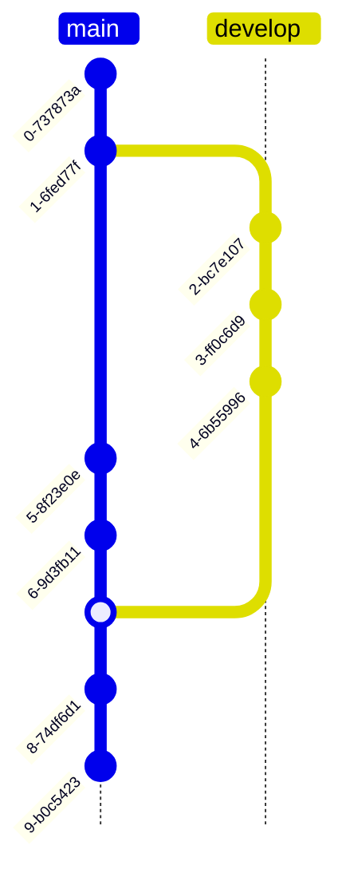
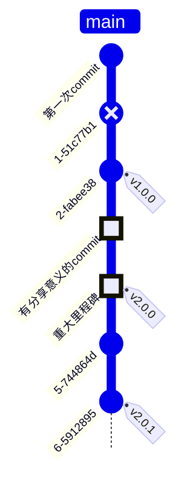

[Git版本分支图](https://mermaid.js.org/syntax/gitgraph.html)用于展示版本库中提交（commit）的历史记录和分支结构的图形化表示方式。
它以图表形式展示了每个提交的节点，以及它们之间的关系和分支的演变。

mermaid的gitGraph支持git的以下操作

- commit
- branch
- checkout
- merge

## 基本语法

默认分支从顶至底(TB)展示，默认分支为`main`

<table>
<tbody>
<tr>
<td width="45%">

```mmd
gitGraph TB:
  commit
  commit
  branch develop
  commit
  commit
  commit
  checkout main
  commit
  commit
  merge develop
  commit
  commit
```

</td>
<td width="55%">



</td>
</tr>
</tbody>
</table>

### commit

每个commit可以默认格式是`序号-自动生成的hash串`，可以自定义commit id，commit不同类型形状展示不同， commit上可以打tag。

| 分支类型      | 作用                    |
|:----------|:----------------------|
| NORMAL    | 默认的commit类型，表示为圆形     |
| REVERSE   | 回滚commit，带×的圆形        |
| HIGHLIGHT | 高亮commit，用于凸显特定commit |

<table>
<tbody>
<tr>
<td>

```mmd
gitGraph TB:
  commit id: "第一次commit"
  commit type: REVERSE
  commit tag: "v1.0.0"
  commit type: HIGHLIGHT id: "有分享意义的commit"
  commit type: HIGHLIGHT tag: "v2.0.0" id: "重大里程碑"
  commit
  commit tag: "v2.0.1"
```

</td>
<td>



</td>
</tr>
</tbody>
</table>

### branch、checkout

branch用于创建分支，checkout用于切换分支，`cherry-pick`功能有能体现，可以通过order属性控制分支顺序

使用cherry-pick的前提

- 需要提供commit id，若commit id不存在则出错
- 提供的commit id必须不能出现在当前分支
- 在cherry-pick前当前分支至少有一个commit，否则出错

<table>
<tbody>
<tr>
<td width="30%">

```mmd
gitGraph LR:
  commit
  branch dev
  checkout dev order: 2
  commit id: "special-id"
  commit
  checkout main
  commit
  cherry-pick id: "special-id"
  commit
  branch feature order: 1
  checkout feature
  commit
  commit
```

</td>
<td width="70%">


</td>
</tr>
</tbody>
</table>

### merge

分支合并，指定要merge的分支名称，merge的分支不能是当前分支

<table>
<tbody>
<tr>
<td width="20%">

```mmd
gitGraph LR:
  commit
  branch dev
  checkout dev
  commit
  commit
  branch feature
  checkout feature
  commit
  commit
  checkout dev
  commit
  merge feature
  commit
  commit
  checkout main
  commit
  merge dev
```

</td>
<td width="80%">


</td>
</tr>
</tbody>
</table>

### 分支方向

分支默认为从顶至底(TB)，可以为从左到右(LR)方向，添加方向后注意后面的冒号不能省略，这里以上面merge示例为例。

<table>
<tbody>
<tr>
<td width="20%">

```mmd
gitGraph LR:
  commit
  branch dev
  checkout dev
  commit
  commit
  branch feature
  checkout feature
  commit
  commit
  checkout dev
  commit
  merge feature
  commit
  commit
  checkout main
  commit
  merge dev
```

</td>
<td>


</td>
</tr>
</tbody>
</table>

### 自定义配置

自定义配置主要通过在gitGraph关键字前加初始化配置的json，格式如下:

```javascript
{
  // 不能有单引号 其他属性必须有单引号 感觉这个好扯淡
  init: {
    // 日志
    'logLevel': "debug",
    // 主题 可选值base、forest、dark、default、neutral
    'theme': 'default',
    // 主题变量
    'themeVariables': {
      // 自定义分支颜色 最多设置8条
      'git0': '#ff0000',
      'git1': '#00ff00',
      'git2': '#0000ff',
      'git3': '#ff00ff',
      'git4': '#00ffff',
      'git5': '#ffff00',
      'git6': '#ff00ff',
      'git7': '#00ffff',
      // 分支名称颜色 按照分支顺序
      'gitBranchLabel0': '#ffffff',
      'gitBranchLabel1': '#ffffff',
      'gitBranchLabel2': '#ffffff',
      'gitBranchLabel3': '#ffffff',
      'gitBranchLabel4': '#ffffff',
      'gitBranchLabel5': '#ffffff',
      'gitBranchLabel6': '#ffffff',
      'gitBranchLabel7': '#ffffff',
      'gitBranchLabel8': '#ffffff',
      'gitBranchLabel9': '#ffffff',
      // 高亮commit颜色
      'gitInv0': '#ff0000',
      'gitInv1': '#ff0000',
      'gitInv2': '#ff0000',
      'gitInv3': '#ff0000',
      'gitInv4': '#ff0000',
      'gitInv5': '#ff0000',
      'gitInv6': '#ff0000',
      'gitInv7': '#ff0000',
      // commit label颜色
      'commitLabelColor': '#ff0000',
      // commit背景色
      'commitLabelBackground': '#00ff00',
      // commit字体大小
      'commitLabelFontSize': '16px',
      // tag label颜色
      'tagLabelColor': '#ff0000',
      // tag背景色
      'tagLabelBackground': '#00ff00',
      // tag 边框颜色
      'tagLabelBorder': '#0000ff',
      // tag字体大小
      'tagLabelFontSize': '16px'
    },
    // 图相关配置
    'gitGraph': {
      // 是否展示分支名称
      'showBranches': true,
      // 是否展示commit label
      'showCommitLabel': true,
      // commit label展示方向 默认是垂直方向 改为false是水平
      'rotateCommitLabel': true,
      // main分支名称 默认是main
      'mainBranchName': 'main'
    }
  }
}
```

## 完整示例

<table>
<tbody>
<tr>
<td>

```mmd
%%{
  init: {
    'theme': 'base',
    'themeVariables': {
      'git0': 'orange',
      'git1': 'blue',
      'git2': 'purple',
      'gitBranchLabel0': 'white',
      'gitBranchLabel1': 'red',
      'gitBranchLabel2': 'black',
      'gitInv0': 'pink',
      'commitLabelColor': 'black',
      'commitLabelBackground': '#gray',
      'commitLabelFontSize': '10px',
      'tagLabelColor': 'white',
      'tagLabelBackground': '#00ff00',
      'tagLabelBorder': '#0000ff',
      'tagLabelFontSize': '16px'
    },
    'gitGraph': {
      'rotateCommitLabel': false,
      'mainBranchName': 'master'
    }
  }
}%%
gitGraph TB:
  commit
  commit type: HIGHLIGHT
  branch dev
  checkout dev
  commit tag: "v1"
  commit
  branch feature
  checkout feature
  commit
  commit
  checkout master
  commit
  merge feature
  commit tag: "v2"
  commit
```

</td>
<td>


</td>
</tr>
</tbody>
</table>
