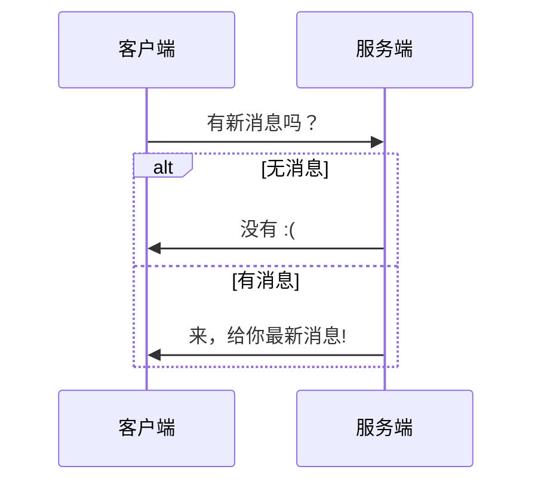
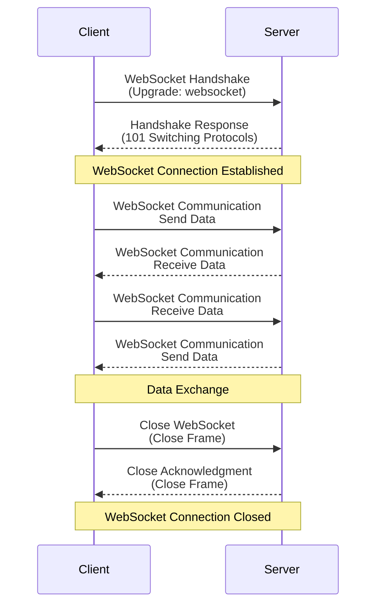
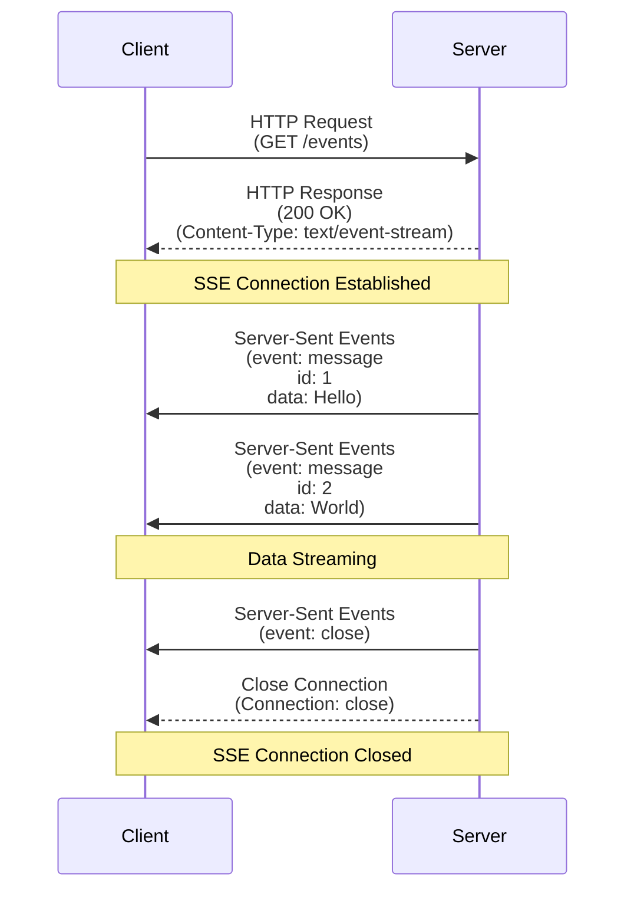
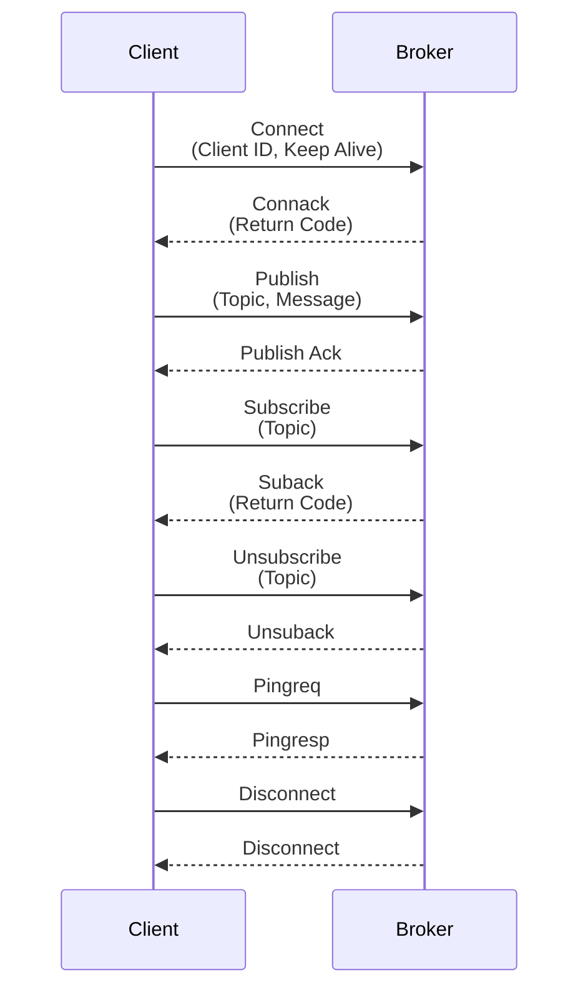

Web消息推送技术被广泛应用于各种场景，主要目的是实时传递信息，提高用户体验和系统响应速度。

- 实时通信
    - 聊天应用：微信、QQ、WhatsApp、Slack
    - 协作：Confluence、钉钉文档
- 社交媒体通知
    - 动态更新：Facebook、Twitter、微博等，推送好友动态、点赞和评论通知
    - 事件提醒：推送用户关注的事件或活动提醒，如直播开始通知等
- 实时监控和告警
    - 系统监控：如运维平台，实时推送服务器状态和异常告警
    - 安全告警：安全系统实时推送入侵检测和其他安全事件通知
- 位置和导航服务
    - 实时交通更新：如谷歌地图、高德地图、腾讯地图等，推送交通拥堵和事故信息
    - 位置提醒：基于用户位置，推送附近的餐馆、商店或景点信息
- 游戏
    - 游戏动态：如在线游戏，推送好友上线、游戏邀请和赛事通知
    - 奖励和活动：推送游戏内的奖励领取通知和活动参与提醒

::: tip 任务目标
假设我们现在需要实现一个新消息数量的需求，当用户有新消息时，页面显示实时/准实时显示消息数量。
:::

## 轮询

客户端频繁请求服务器，获取服务端最新的数据，根据响应的数据做进一步处理，收到响应后再次发起新的请求。



### 短轮询

客户端以固定的频率请求服务器，服务器返回当前最新数据，根据响应结果做业务处理。

#### 代码示例

::: code-group

```js [client.js]
// 以2秒的频率固定请求
setTimeout(() => {
    fetch("http://localhost:8080/polling")
        .then(it => it.json())
        .then(it => {
            console.info(it);
            // TODO 新消息数量展示
        })
        .catch(e => console.error(e))
}, 2000);
```

```java [server.java]
@RequestMapping
@RestController
public class PollingController {
    private static final SecureRandom SECURE_RANDOM = SecureRandom.getInstance("SHA1PRNG", "SUN");
    @GetMapping("/polling")
    public int messages() {
        // 返回一个10内的随机数字当作新消息数量
        return SECURE_RANDOM.nextInt(10);
    }
}
```

:::

#### 优缺点

::: tip 优点
- 实现简单，易部署，无需特殊协议或库支持
- 兼容性好，基于标准HTTP，几乎所有浏览器都支持
:::

::: danger 缺点
- 效率低，每次请求都会建立新的连接，增加服务器开销
- 大量客户端频繁请求会增加服务器和网络带宽负载
- 实时性低，实时性取决于请求频率
:::

### 长轮询

客户端向服务器发起请求，若存在数据，服务端立刻返回，否则直到有数据或者请求超时，每当服务端响应后，又开始下一轮的请求。

#### 代码示例

::: code-group
```js [client.js]
// 有超时时长的fetch
function fetchWithTimeout(url, options, timeout = 5000) {
    // 创建一个用于处理超时的 Promise
    const timeoutPromise = new Promise((_, reject) => {
        setTimeout(() => {
            reject(new Error('Request timed out'));
        }, timeout);
    });

    // 使用 Promise.race 来处理 fetch 请求和超时 Promise
    return Promise.race([
        fetch(url, options),
        timeoutPromise
    ]);
}

function longPolling(){
    // 默认超时6秒 尽量比服务端的超时时长长
    fetchWithTimeout('http://localhost:8080/long-polling', {}, 6000)
        .then(it => it.json())
        .then(it => {
            console.info(it);
            // TODO 新消息数量展示
        })
        .catch(e => console.error(e))
        // 递归调用
        .finally(() => longPolling());
}

// 开始长轮询
longPolling();
```

```java [server.java]
import java.util.concurrent.TimeUnit;

@RequestMapping
@RestController
public class PollingController {
    private static final SecureRandom SECURE_RANDOM = SecureRandom.getInstance("SHA1PRNG", "SUN");

    @GetMapping("/polling")
    public DeferredResult<Integer> messages() {
        // 长连接保持5秒 超时返回0新消息
        DeferredResult<Integer> result = new DeferredResult<Integer>(5000, 0);
        
        // 这里模拟查询过程 结合实际改写
        new Thread(() -> {
            while (true) {
                int count = SECURE_RANDOM.nextInt(10);
                // 假设只取大于5的数字
                if (count > 5) {
                    result.setResult(count);
                    break;
                }

                try{
                    TimeUnit.SECONDS.sleep(1);
                } catch(InterruptedException ignore){
                }
            }
        }).start();

        return result;
    }
}
```
:::

#### 优缺点
::: tip 优点

- 减少了不必要的轮询次数，降低了网络和服务器的负载
- 相比短轮询，提高了实时性，服务端可以在数据可用时立即推送
- 兼容性好，易于实现

:::

::: danger 缺点

- 仍然需要反复发起新的请求，因此在某种程度上仍有一定的轮询成本
- 不同浏览器对于长连接的支持程度不同，有一定的兼容性问题
- 开销比较大，实时性比较差
- 不适合高频率的实时数据推送

:::

## WebSocket

客户端与服务器建立一个持久的双向连接，可以在同一连接上双向发送数据。



### 代码示例

::: code-group
```js [client.js]
let socket = new WebSocket("ws://localhost:8080/ws");

socket.onopen = function(event) {
    console.log("Connected to WebSocket server.");
};

socket.onmessage = function(event) {
    console.info(event.data);
    // TODO 新消息数量展示
};

socket.onclose = function(event) {
    console.log("Disconnected from WebSocket server.");
};

socket.onerror = function(error) {
    console.error("WebSocket error:", error);
};
```

```java [server.java]
// ws处理器
@Component
public class WebSocketMessageHandler extends TextWebSocketHandler {
    // 缓存ws会话
    private final ConcurrentMap<String, WebSocketSession> sessions = new ConcurrentHashMap<>();

    @Override
    public void afterConnectionEstablished(WebSocketSession session) throws Exception {
        sessions.put(session.getId(), session);
    }

    @Override
    public void handleTextMessage(WebSocketSession session, TextMessage message) throws Exception {
        // 处理收到客户端的消息
        // 这里按照功能需求 无需实现
    }

    @Override
    public void afterConnectionClosed(WebSocketSession session, CloseStatus status) throws Exception {
        // 连接关闭时 释放会话
        sessions.remove(session.getId());
    }

    public void sendMessage(String userId, int count) {
        WebSocketSession session = sessions.get(userId);
        if (session != null) {
            try {
                session.sendMessage(new TextMessage(String.valueOf(count)));
            } catch (Exception e) {
                // 异常处理
            }
        }
    }
}

@Configuration
@EnableWebSocket
public class WebSocketConfig implements WebSocketConfigurer {

    private final WebSocketMessageHandler webSocketMessageHandler;

    public WebSocketConfig(WebSocketMessageHandler webSocketMessageHandler) {
        this.webSocketMessageHandler = webSocketMessageHandler;
    }

    @Override
    public void registerWebSocketHandlers(WebSocketHandlerRegistry registry) {
        registry.addHandler(webSocketMessageHandler, "/ws").setAllowedOrigins("*");
    }
}

// 模拟消息查询
@Service
public class MessageService {

    private final WebSocketMessageHandler webSocketMessageHandler;
    // 消息数量mock
    private static final SecureRandom SECURE_RANDOM = SecureRandom.getInstance("SHA1PRNG", "SUN");

    public MessageService(WebSocketMessageHandler webSocketMessageHandler) {
        this.webSocketMessageHandler = webSocketMessageHandler;
    }

    /**
     * 消息新增时触发消息数量变更
     * @param userId 消息所属用户id
     */
    public void onMessageAdd(String userId) {
        // 消息数量mock
        int count = SECURE_RANDOM.nextInt(10);
        // 发送ws消息
        this.webSocketMessageHandler.sendMessage(userId, count);
    }
}
```

```xml [Maven依赖]
<dependencies>
    <dependency>
        <groupId>org.springframework.boot</groupId>
        <artifactId>spring-boot-starter-websocket</artifactId>
    </dependency>
</dependencies>
```

```nginx [nginx配置]
server {
    listen 8080;
    
    location /ws {
        proxy_pass http://localhost:8000/ws;

        # ws代理
        proxy_http_version 1.1;
        proxy_set_header Upgrade $http_upgrade;
        proxy_set_header Connection upgrade;
    }
}
```
:::

### 优缺点

::: tip 优点

- 实时性高，支持双向通信
- 开销低，连接建立后，后续的数据传输开销小
- 适用于高频率的实时数据传输

:::

::: danger 缺点

- 实现复杂度较高，需额外的服务器支持，如Socket服务器
- 防火墙和代理服务器的兼容性问题，可能需要额外配置
- 需要处理断线重连，比如ping pong机制
- 较新的技术，比较就的浏览器不支持，如IE

:::

## SSE

SSE(Server Send Event)，客户端通过HTTP向服务器发送一个请求，服务器保持连接并通过该连接持续推送数据到客户端。



### 代码示例

::: code-group
```js [client.js]
const eventSource = new EventSource("http://localhost:8080/sse");

eventSource.onmessage = function(event) {
    document.getElementById("messageCount").innerText = "Current message count: " + event.data;
};

eventSource.onerror = function(event) {
    console.error("SSE error:", event);
    // TODO 新消息数量展示
};

eventSource.onopen = function(event) {
    console.log("Connected to SSE server.");
};
```

```java [server.java]
@Service
@Slf4j
public class MessageService {
    // 消息数量mock
    private static final SecureRandom SECURE_RANDOM = SecureRandom.getInstance("SHA1PRNG", "SUN");
    // sse会话缓存
    private static final Map<String, Set<SseEmitter>> SESSIONS = new HashMap<>(10);

    /**
     * 创建sse会话
     * @param userId 用户id
     */
    public SseEmitter createEmitter(String userId) {
        // 每十分钟做一次重连
        SseEmitter emitter = new SseEmitter(600000);
        // 关闭连接 内存中移除连接信息
        sseEmitter.onCompletion(() -> this.close(userId, emitter));
        // 连接断开或者超时 关闭连接
        sseEmitter.onTimeout(sseEmitter::complete);
        // 出现发送错误
        sseEmitter.onError(e -> log.warn(e.getMessage(), e));
        
        // 缓存新会话
        SESSIONS.merge(userId, new HashSet<>(Collections.singletonList(emitter)), (o, n) -> {
            o.addAll(n);

            return o;
        });
        
        return emitter;
    }

    /**
     * 消息新增时触发消息数量变更
     * @param userId 消息所属用户id
     */
    public void onMessageAdd(String userId) {
        // 消息数量mock
        int count = SECURE_RANDOM.nextInt(10);
        // 若消息数量大于等于5才做消息推送 这里只是做消息推送模拟
        if (count < 5) {
            return;
        }

        // 发送sse消息
        Set<SseEmitter> emitters = SESSIONS.get(userId);
        if (emitters != null) {
            emitters.forEach(it -> ite.send(count, MediaType.TEXT_PLAIN));
        }
    }

    /**
     * 会话关闭
     * @param userId 用户id
     * @param emitter {@link SseEmitter}
     */
    protected void close(String userId, SseEmitter emitter) {
        Set<SseEmitter> emitters = SESSIONS.get(userId);
        if (emitters != null) {
            emitters.remove(emitter);
        }
    }
}

@RestController
public class MessageController {
    @Autowired
    private MessageService messageService;

    @GetMapping(value = "/sse", produces = MediaType.TEXT_EVENT_STREAM_VALUE)
    public SseEmitter createEmitter() {
        // TODO 按需获取用户id或者会话id
        return messageService.createEmitter("id");
    }
}
```
:::

### 优缺点

::: tip 优点

- 实现简单，基于HTTP协议，浏览器原生支持（不需要额外的库）
- 高效，保持一个长连接，减少了频繁建立和断开连接的开销
- 可靠性高，自动重连和事件ID管理

:::

::: danger 缺点

- 仅支持单向通信（服务器到客户端）
- 不支持所有浏览器（如IE和部分老版本浏览器）
- 需要现代Web服务器支持持续连接
  
:::

## MQTT

MQTT（Message Queuing Telemetry Transport）是一种轻量级、基于发布-订阅模式的消息传输协议，适用于资源受限的设备和低带宽、高延迟或不稳定的网络环境。
它在物联网应用中广受欢迎，能够实现传感器、执行器和其它设备之间的高效通信。

服务端可以以`MQTT`协议接入，客户端(浏览器)可以以`WebSocket`协议接入，该示例是以[EMQX](https://www.emqx.com)平台提供的服务实现。



### 代码示例

::: code-group

```js [client.js]
const client = mqtt.connect('wss://mb1e2ea6.ala.cn-hangzhou.emqxsl.cn:8084', {
    path: '/mqtt',
    // 清除会话
    clean: true,
    // 超时时间
    connectTimeout: 4000,
    // 认证信息
    clientId: 'test',
    username: 'test',
    password: 'test',
}), 
// TODO 按需设置用户id    
userId = 'userId';

client.on('connect', function () {
    console.log('Connected')
    // topic订阅
    client.subscribe('/message/' + userId, function (err) {
        if (err) {
            console.error('subscribe error', err);
        }
    })
});

// 接收消息
client.on('message', function (topic, message) {
    // 接收到的消息topic
    console.log(topic);
    // 消息内容
    console.log(message.toString());
    // TODO 新消息数量展示
});
```

```java [server.java]
@Configuration
@IntegrationComponentScan
public class MqttConfig {
    @Bean
    public MqttPahoClientFactory mqttClientFactory() {
        DefaultMqttPahoClientFactory factory = new DefaultMqttPahoClientFactory();
        // 按需设置
        factory.setServerURIs("tcp://localhost:1883");
        return factory;
    }

    @Bean
    public MessageChannel mqttOutputChannel() {
        return new DirectChannel();
    }

    @Bean
    public MessageHandler mqttOutbound() {
        MqttPahoMessageHandler messageHandler = 
            new MqttPahoMessageHandler("SpringBootClient", mqttClientFactory());
        messageHandler.setAsync(true);
        messageHandler.setDefaultTopic("test/topic");
        return messageHandler;
    }

    @Bean
    public MessageProducer inbound() {
        MqttPahoMessageDrivenChannelAdapter adapter =
            new MqttPahoMessageDrivenChannelAdapter("SpringBootClientInbound", mqttClientFactory(), "test/topic");
        adapter.setConverter(new DefaultPahoMessageConverter());
        adapter.setQos(1);
        adapter.setOutputChannel(mqttInputChannel());
        
        return adapter;
    }

    @Bean
    public MessageChannel mqttInputChannel() {
        return new DirectChannel();
    }
}

@MessagingGateway(defaultRequestChannel = "mqttOutputChannel")
public interface MqttGateway {
    /**
     * 指定topic默认QoS进行消息发送
     * @param topic topic
     * @param payload 消息
     */
    void sendToMqtt(@Header(MqttHeaders.TOPIC) String topic, String payload);
    /**
     * 指定topic进行消息发送
     * @param topic topic
     * @param qos qos
     * @param payload 消息
     */
    void sendToMqtt(@Header(MqttHeaders.TOPIC) String topic, @Header(MqttHeaders.QOS) int qos, String payload);
}

@Service
@Slf4j
public class MessageService {
    @Autowired
    MqttGateway mqttGateway;
    // 消息数量mock
    private static final SecureRandom SECURE_RANDOM = SecureRandom.getInstance("SHA1PRNG", "SUN");

    /**
     * 消息新增时触发消息数量变更
     * @param userId 消息所属用户id
     */
    public void onMessageAdd(String userId) {
        // 消息数量mock
        int count = SECURE_RANDOM.nextInt(10);
        // 若消息数量大于等于5才做消息推送 这里只是做消息推送模拟
        if (count < 5) {
            return;
        }

        // 消息发送
        this.mqttGateway.sendToMqtt("/message/" + userId, String.valueOf(count));
    }
}
```

```xml [Maven配置]
<dependencies>
    <dependency>
        <groupId>org.springframework.boot</groupId>
        <artifactId>spring-boot-starter-web</artifactId>
    </dependency>
    <dependency>
        <groupId>org.springframework.integration</groupId>
        <artifactId>spring-integration-mqtt</artifactId>
    </dependency>
</dependencies>
```
:::

### 优缺点

::: tip 优点

- 轻量级和低带宽：MQTT设计之初是为了支持资源受限的设备和低带宽、不稳定的网络环境。它的协议开销小，适合嵌入式系统和物联网（IoT）设备
- QoS（质量服务等级）支持，MQTT支持三种服务质量等级（QoS）
    - QoS 0：最多一次
    - QoS 1：至少一次，消息可能重复
    - QoS 2：只有一次，消息确保到达且仅一次
- 离线消息：MQTT可以为离线客户端存储消息，当客户端重新连接时将消息发送给它
- 主题和发布/订阅模式：MQTT使用主题进行消息分类，通过发布/订阅模式实现松耦合的消息通信
- 内置保持连接机制：MQTT协议通过心跳机制维持客户端与服务器的连接，适用于长期连接

::: 

::: danger 缺点

- 较少的浏览器支持：MQTT在浏览器环境中使用不如WebSocket方便，需要使用额外的库（如[MQTT.js](https://github.com/mqttjs/MQTT.js)）
- 协议复杂性：相比于WebSocket，MQTT的配置和使用可能更复杂，需要更多的学习和配置
- 依赖消息代理：MQTT需要一个消息代理（如[Mosquitto](https://github.com/eclipse/mosquitto)、[EMQX](https://www.emqx.com/)）来处理消息传递

:::

## 其他

一些其他实现方案，实现会较为复杂。

### WebRTC

WebRTC（Web Real-Time Communication）是一个开源项目，提供了支持浏览器进行实时语音对话或视频对话的功能，并通过简单的JavaScript API实现。
WebRTC包含了音频、视频、数据通道等实时通信能力，使得开发者能够在浏览器中构建高效的实时通信应用。

#### 优缺点

::: tip 优点
- 低延迟：直接的点对点连接，确保了数据传输的低延迟
- 高效传输：支持音视频和任意数据的高效传输，适合多种实时应用
- 安全性：默认支持加密，确保数据传输的安全
- 跨平台：支持多种设备和平台，包括桌面和移动设备
:::

::: danger 缺点
- 复杂性：涉及到信令、NAT 穿越等技术细节，开发相对复杂
- 浏览器兼容性：尽管现代浏览器广泛支持 WebRTC，但仍需考虑不同浏览器之间的兼容性
- 网络限制：某些网络环境（如严格防火墙、NAT）可能会限制 WebRTC 的连接建立
:::

### XMPP

XMPP（Extensible Messaging and Presence Protocol），即可扩展消息与状态协议，是一种基于XML的通信协议，最初由Jabber开发，
用于即时消息（IM）和在线状态信息（Presence Information）。XMPP被设计为开放标准协议，并且已经成为IETF的RFC3920和RFC3921。

#### 优缺点
::: tip 优点
- 即时通信：设计用于实时消息传递，广泛用于聊天应用
- 扩展性强：协议本身非常灵活，可扩展性强
- 现有生态：有大量现成的客户端和服务器实现
:::

::: danger 缺点
- 复杂性：实现和管理较为复杂，需要熟悉XMPP协议
- 协议开销：相对于HTTP，XMPP的消息格式和传输开销较大
:::

### WebTransport

WebTransport 是一种用于客户端和服务器之间低延迟、安全、双向通信的新协议，
特别适用于实时应用。它基于 HTTP/3 和 QUIC 协议，提供了高效的数据传输能力。

#### 优缺点

::: tip 优点
- HTTP/3支持：基于QUIC协议，利用HTTP/3的优势，如低延迟和多路复用
- 可靠和不可靠传输：支持同时进行可靠和不可靠的数据传输
- 双向通信：支持全双工通信，适合复杂的实时应用
- 安全性：内置支持TLS 1.3，提供高安全性
:::

::: danger 缺点
- 新技术：仍然较新，浏览器和服务器的支持可能还不完全
- 实现复杂性：与WebSocket相比，实现和调试可能更复杂
:::
