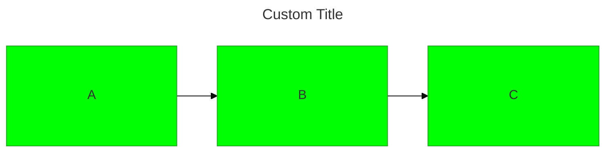
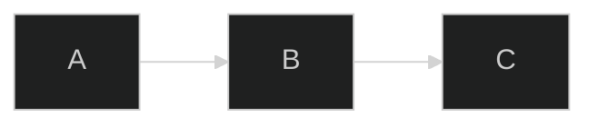

当mermaid启动时，会提取配置以确定图表所需要的配置，配置一共有4个来源：

- 默认配置：即mermaid的默认配置。
- 站点配置：即各个站点会对mermaid做各自个性化的默认配置。
- Frontmatter(`v10.5.0+`)：在图表前使用yaml前言设定配置参数，这些参数会用于渲染。
- ~~Directives~~(`已被Frontmatter取代`，在`v11.12.2`中依然有效)：作用和前言一致，也是在图表前使用指令设定配置参数。

参见[Mermaid Config Schema](https://mermaid.js.org/config/schema-docs/config.html)
，相应的[Json Schema](https://mermaid.js.org/schemas/config.schema.json)，
同时也是[MermaidConfig](https://github.com/mermaid-js/mermaid/blob/develop/packages/mermaid/src/config.type.ts#L58)的定义。

## 站点默认配置

这里以[vitepress-plugin-mermaid](https://emersonbottero.github.io/vitepress-plugin-mermaid/guide/getting-started.html#setup-it-up)
为例，以下是官方示例配置：

::: code-group

```js [.vitepress/config.js]
import {withMermaid} from "vitepress-plugin-mermaid";

export default withMermaid({
    // your existing vitepress config...
    // optionally, you can pass MermaidConfig
    mermaid: {
        // refer https://mermaid.js.org/config/setup/modules/mermaidAPI.html#mermaidapi-configuration-defaults for options
        // 这里扩展mermaid的站点配置 用于覆盖mermaid的默认配置
        theme: "forest"
    },
    // optionally set additional config for plugin itself with MermaidPluginConfig
    mermaidPlugin: {
        // 扩展样式
        class: "mermaid my-class", // set additional css classes for parent container 
    },
});
```

:::

## Frontmatter

[FrontMatterMetadata](https://github.com/mermaid-js/mermaid/blob/develop/packages/mermaid/src/diagram-api/frontmatter.ts#L6-L11)
定义如下，可以在图表最前面使用yaml覆盖默认配置。

```ts
interface FrontMatterMetadata {
    // 标题
    title?: string;
    // Allows custom display modes. Currently used for compact mode in gantt charts.
    // 用于甘特图的显示模式
    displayMode?: GanttDiagramConfig['displayMode'];
    // mermaid配置
    config?: MermaidConfig;
}
```

Frontmatter示例：

```mmd
---
title: Custom Title
config:
  theme: base
  themeVariables:
    primaryColor: "#00ff00"
  flowchart:
    padding: 50
---

flowchart LR
A --> B --> C
```



## Directives

[Directives](https://mermaid.js.org/config/directives.html)的作用跟Frontmatter是类似的，只是格式和语法不太一样，在
`v10.5.0`就声明不建议使用，后期某个版本可能会永久移除。
参考[utils.ts](https://github.com/mermaid-js/mermaid/blob/develop/packages/mermaid/src/utils.ts#L99-L131)
中提取指令源码。跟Frontmatter类似，除了`title`属性外，
init/initialize块中的对象定义即为[MermaidConfig](https://github.com/mermaid-js/mermaid/blob/develop/packages/mermaid/src/config.type.ts#L58)
，只是使用json定义的。

::: tip 提示
JSON对象必须是有效的键值对且key必须用引号括起来，有效的键值对会在config中生效。
:::

Directives示例：

```mmd
%%{
  init: { 
    'logLevel': 'debug', 
    'theme': 'dark' 
  } 
}%%
graph LR
A --> B --> C
```


