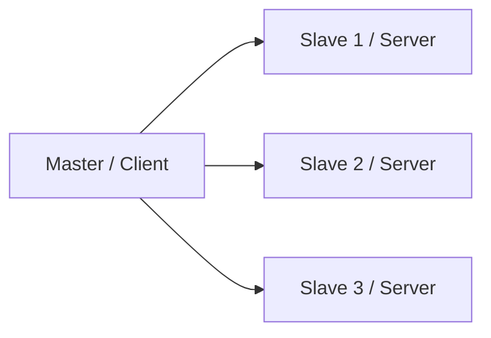

[Modbus](https://www.modbus.org)协议是工业自动化领域中最常用的通信协议之一，用途非常广泛，主要用于设备间数据传输与控制指令交换。

- 工业自动化
    - PLC(如西门子、施耐德、欧姆龙等)
    - 工业机器人状态监控与控制
    - 生产线数据采集与监控
- 电力/能源监控
    - 电能表数据读取(如ABB、施耐德多功能表)
    - UPS、电池组状态监控
    - 光伏/风电设备实时数据采集
- 楼宇自动化
    - 空调、新风系统状态监控与控制
    - 水泵/风机运行监控
    - 照明控制系统
- 环境监测
    - 粉尘、烟气、空气质量(PM2.5、VOC)采集
    - 水质监测(PH、COD、DO传感器)
- 交通与市政
    - 路灯远程集中控制
    - 隧道通风与照明系统监控与控制
    - 水务泵站监控
- 农业与温室
    - 灌溉系统控制
    - 温室气候控制
- 仓储与物流
    - 冷链温湿度实时监测
    - 仓库自动化传输控制

## 协议介绍

Modbus协议是一种主从协议，其中主设备（Master）负责发起通信，从设备（Slave）负责响应通信。
Modbus协议的通信过程如下：

1. 主设备向从设备发送请求，请求包含从设备的地址和要读取或写入的数据类型和地址。
2. 从设备响应主设备的请求，响应包含从设备的地址和读取或写入的数据。
3. 主设备根据响应的数据进行后续处理。



## 传输方式

- **Modbus RTU**

    采用高效的二进制编码，通过`RS-485`串行总线进行传输，其数据帧紧凑且依赖 CRC 校验和严格时序，确保了通信的高效与可靠，因此成为工业现场层面连接 PLC、仪表和传感器等设备的主力军。
    
    **波特率、数据位、停止位、奇偶校验这些参数在主从站之间必须完全一致。**
- **Modbus ASCII**

    采用可读的十六进制ASCII字符编码，并以明确的字符作为帧的起止界，虽其传输效率仅为 RTU 的一半，但胜在可读性极佳，无需专用工具即可调试，故常用于设备诊断或兼容某些老旧系统。
- **Modbus TCP/IP**

    将Modbus协议封装在标准的TCP/IP数据包中，利用网络基础设施实现了远超串行通信的距离和速度，并易于与上层信息系统集成；尽管其实时性可能受网络状况影响且需考虑网络安全，但它无疑是现代 SCADA 系统、工业物联网和实现远程运维的理想选择。
    
    默认端口为**502**。

| 特性       | Modbus RTU        | Modbus ASCII        | Modbus TCP/IP           |
|:---------|:------------------|:--------------------|:------------------------|
| **协议编码** | 二进制（紧凑，效率高）       | 十六进制ASCII字符（可读，效率低） | 二进制（基于TCP/IP数据包）        |
| **物理介质** | RS-485（最多）、RS-232 | RS-485、RS-232       | 以太网（RJ45）、Wi-Fi         |
| **通信速度** | 快（相同波特率下，数据量小）    | 慢（相同波特率下，数据量大一倍）    | 非常快（标准以太网速率）            |
| **通信距离** | 远（RS-485可达1200米）  | 远（RS-485可达1200米）    | 远（借助网络设施，可全球范围）         |
| **拓扑结构** | 总线型（多设备）或点对点      | 总线型（多设备）或点对点        | 星型（借助网络交换机）             |
| **成本**   | 低                 | 低                   | 相对较高（需要以太网基础设施）         |
| **调试难度** | 中等（需要专用工具解析报文）    | 简单（可用终端软件直接查看）      | 中等（可用网络抓包工具，如Wireshark） |
| **典型应用** | 工业现场、PLC、传感器、仪表   | 老旧设备、特定行业（如能源）      | SCADA系统、HMI、IoT         |

## 寄存器类型

| 类型               | 功能    | 地址范围        | 读写 | 使用场景               |
|------------------|-------|-------------|----|--------------------|
| Coil             | 离散输出  | 00001~09999 | 读写 | 用于控制设备开关状态         |
| Discrete Input   | 离散输入  | 10001~19999 | 读  | 用于读取设备开关状态         |
| Input Register   | 输入寄存器 | 20001~29999 | 读  | 用于读取设备的参数、设定值、数值量等 |
| Holding Register | 保持寄存器 | 30001~39999 | 读写 | 用于存储设备的温度、电流、电压等   |

- 单个保持寄存器只能表示0~65535，为了表示更大的数、负数或浮点数，需要将多个寄存器组合使用。
- 32位整数/浮点数：通常占用2个连续的寄存器。但需要注意字节序问题（Modbus通常使用大端序，但有些设备可能使用小端序）。 多字节数据类型如Long/Float/Double会存在ABCD、DCBA、CDAB、BADC的问题，需要注意字节序。
    ```mermaid
      flowchart TD
      A["原始32位数据: 0x41480000，分解为4个字节:<BR> A=41, B=48,<BR> C=00, D=00"]
      
          A --> B["在Modbus中存储为2个连续的16位寄存器"]
          
          B --> C1["寄存器 m<br>（先使用的寄存器）"]
          B --> C2["寄存器 m+1<br>（后使用的寄存器）"]
          
          C1 --> D1["高字节 High"]
          C1 --> D2["低字节 Low"]
          
          C2 --> D3["高字节 High"]
          C2 --> D4["低字节 Low"]
      
          subgraph Z [四种常见排列模式]
              direction TB
              S1["ABCD模式<br>大端序"]
              S2["BADC模式<br>小端序 + 字节交换"]
              S3["CDAB模式<br>大端序 + 字交换"]
              S4["DCBA模式<br>小端序"]
          end
      
          D1 & D2 & D3 & D4 --> Z
    ```
- 长字符串：占用多个连续的寄存器，每个寄存器存放2个字符（ASCII码）。

## 常用工具

- [modbus-poll](https://downloaddevtools.com/en/product/3614/free-download-modbus-poll)：主站模拟工具
- [modbus-slave](https://downloaddevtools.com/en/product/3615/free-download-modbus-slave)：从站模拟工具
- [QModMaster](https://sourceforge.net/projects/qmodmaster/): 开源工具
