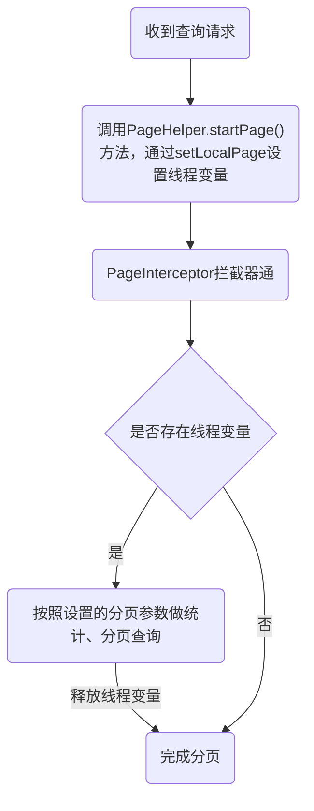

最近同事遇到一个问题，偶尔会出现，异常堆栈显示是一个Class转换问题，关键堆栈信息如下：

```log
java.lang.ClassCastException: com.mask.ljy.damconstruction.environmentalProtection.entity.ProtectionArtificialVo cannot be cast to com.mask.ljy.damconstruction.safetyElimination.entity.LevelStaticsVo
    at java.util.stream.ReferencePipeline$4$1.accept(ReferencePipeline.java:210)
    at java.util.ArrayList$ArrayListSpliterator.forEachRemaining(ArrayList.java:1384)
    at java.util.stream.AbstractPipeline.copyInto(AbstractPipeline.java:482)
    at java.util.stream.AbstractPipeline.wrapAndCopyInto(AbstractPipeline.java:472)
    at java.util.stream.ReduceOps$ReduceOp.evaluateSequential(ReduceOps.java:708)
    at java.util.stream.AbstractPipeline.evaluate(AbstractPipeline.java:234)
    at java.util.stream.IntPipeline.reduce(IntPipeline.java:457)
    at java.util.stream.IntPipeline.sum(IntPipeline.java:415)
    at com.mask.ljy.damconstruction.safetyElimination.service.SafeHiddenService.levelStatistic(SafeHiddenService.java:812)
    at com.mask.ljy.damconstruction.safetyElimination.service.SafeHiddenService$$FastClassBySpringCGLIB$$cf3d9282.invoke(<generated>)
    at org.springframework.cglib.proxy.MethodProxy.invoke(MethodProxy.java:218)
    at org.springframework.aop.framework.CglibAopProxy$CglibMethodInvocation.invokeJoinpoint(CglibAopProxy.java:779)
    at org.springframework.aop.framework.ReflectiveMethodInvocation.proceed(ReflectiveMethodInvocation.java:163)
    at org.springframework.aop.framework.CglibAopProxy$CglibMethodInvocation.proceed(CglibAopProxy.java:750)
    at org.springframework.transaction.interceptor.TransactionInterceptor$1.proceedWithInvocation(TransactionInterceptor.java:123)
    at org.springframework.transaction.interceptor.TransactionAspectSupport.invokeWithinTransaction(TransactionAspectSupport.java:388)
    at org.springframework.transaction.interceptor.TransactionInterceptor.invoke(TransactionInterceptor.java:119)
    at org.springframework.aop.framework.ReflectiveMethodInvocation.proceed(ReflectiveMethodInvocation.java:186)
    at org.springframework.aop.framework.CglibAopProxy$CglibMethodInvocation.proceed(CglibAopProxy.java:750)
    at org.springframework.aop.framework.CglibAopProxy$DynamicAdvisedInterceptor.intercept(CglibAopProxy.java:692)
    at com.mask.ljy.damconstruction.safetyElimination.service.SafeHiddenService$$EnhancerBySpringCGLIB$$14a59c52.levelStatistic(<generated>)
    at com.mask.ljy.damconstruction.safetyElimination.controller.SafeHiddenController.levelStatistic(SafeHiddenController.java:73)
```

## 问题分析及定位

定位开发日志，发现部分sql内容如下，sql语句被莫名其妙加上了`LIMIT ?`，而异常代码位置做的是全量查询，并未做分页。

```sql
SELECT id, name, value FROM t_level_statics LIMIT ?
```

- 检查mybatis中的sql语句无LIMIT语句，排除sql编写错误问题
- 检查服务层代码，也未使用分页插件，排除服务层代码错误问题
- 检查全局mybatis拦截器，仅使用了PageHelper分页插件，排除全局mybatis拦截器错误问题

了解PageHelper的分页插件原理，分析是PageHelper线程变量被污染导致的，即设置了线程变量但未释放，关键java代码如下：

```java
public List<ProtectionArtificialVo> queryProtectionArtificial(ProtectionArtificialSo dto) {
    // ...
    // 省略其他代码
    Page<ProtectionArtificialVo> result = PageHelper.startPage(dto.getCurrent(), dto.getPageSize());
    // 这里没有调用mapper查询 使用PageHelper仅仅是为了创建一个Page对象?!! // [!code error]
    return result; // [!code error]
}
```

::: tip 提示
分析的实例刚好是查询语句被追加了"LIMIT ?"，如果是DML语句，INSERT/UPDATE/DELETE等，
我们会更快的发现定位问题，无论如何我们也不会主动在DML语句加LIMIT语句。
:::

## PageHelper分页原理



- 设置线程变量

PageHelper是通过设置[Page](https://github.com/pagehelper/Mybatis-PageHelper/blob/v6.1.0/src/main/java/com/github/pagehelper/Page.java)对象分页参数为线程变量拦截器才能知道分页方法，
在[PageMethod.startPage](https://github.com/pagehelper/Mybatis-PageHelper/blob/v6.1.0/src/main/java/com/github/pagehelper/page/PageMethod.java#L148)方法设置Page线程变量。

::: code-group
```java{10} [PageMethod.java]
public static <E> Page<E> startPage(int pageNum, int pageSize, boolean count, Boolean reasonable, Boolean pageSizeZero) {
    Page<E> page = new Page<E>(pageNum, pageSize, count);
    page.setReasonable(reasonable);
    page.setPageSizeZero(pageSizeZero);
    //当已经执行过orderBy的时候
    Page<E> oldPage = getLocalPage();
    if (oldPage != null && oldPage.isOrderByOnly()) {
        page.setOrderBy(oldPage.getOrderBy());
    }
    setLocalPage(page);
    return page;
}
```

```java [Page.java]
public class Page<E> extends ArrayList<E> implements Closeable {
    /**
     * 页码，从1开始
     */
    private int pageNum;
    /**
     * 页面大小
     */
    private int pageSize;
    /**
     * 起始行
     */
    private long startRow;
    /**
     * 末行
     */
    private long endRow;
    /**
     * 总数
     */
    private long total;
    /**
     * 总页数
     */
    private int pages;
    /**
     * 包含count查询
     */
    private boolean count = true;
    /**
     * 分页合理化
     */
    private Boolean reasonable;
    /**
     * 当设置为true的时候，如果pagesize设置为0（或RowBounds的limit=0），就不执行分页，返回全部结果
     */
    private Boolean pageSizeZero;
    /**
     * 进行count查询的列名
     */
    private String countColumn;
    /**
     * 排序
     */
    private String orderBy;
    /**
     * 只增加排序
     */
    private boolean orderByOnly;
    /**
     * sql拦截处理
     */
    private BoundSqlInterceptor boundSqlInterceptor;
    private transient BoundSqlInterceptor.Chain chain;
    /**
     * 分页实现类，可以使用 {@link com.github.pagehelper.page.PageAutoDialect} 类中注册的别名，例如 "mysql", "oracle"
     */
    private String dialectClass;
    /**
     * 转换count查询时保留查询的 order by 排序
     */
    private Boolean keepOrderBy;
    /**
     * 转换count查询时保留子查询的 order by 排序
     */
    private Boolean keepSubSelectOrderBy;
    /**
     * 异步count查询
     */
    private Boolean asyncCount;
    
    // 省略其他代码
}
```
:::

- 释放线程变量
    - PageHelper[默认数据库方言](https://github.com/pagehelper/Mybatis-PageHelper/blob/v6.1.0/src/main/java/com/github/pagehelper/PageInterceptor.java#L81)就是PageHelper，当PageInterceptor拦截后会在[finally](https://github.com/pagehelper/Mybatis-PageHelper/blob/v6.1.0/src/main/java/com/github/pagehelper/PageInterceptor.java#L174)中释放线程变量。
    
      ::: code-group
      ```java{7} [PageInterceptor.java]
      @Override
      public Object intercept(Invocation invocation) throws Throwable {
          try {
              // 省略分页拦截器主要代码
          } finally{
              if (dialect != null) {
                  dialect.afterAll();
              }
          }
      }
      ```
      
      ```java{9} [PageHelper.java]
      @Override
      public void afterAll() {
          //这个方法即使不分页也会被执行，所以要判断 null
          AbstractHelperDialect delegate = autoDialect.getDelegate();
          if (delegate != null) {
              delegate.afterAll();
              autoDialect.clearDelegate();
          }
          clearPage();
      }
      ```
        
      :::
  
    - Page默认实现了JDK的[Closeable](https://github.com/openjdk/jdk/blob/jdk8-b120/jdk/src/share/classes/java/io/Closeable.java#L52)，使用try-with-resources语法时会自动释放线程变量。
    
      ::: code-group
      ```java{3} [Page.java]
      @Override
      public void close() {
          PageHelper.clearPage();
      }
      ```
      :::

## 问题解决及建议

在了解了分页原理及定位到问题代码后就很容易解决了，我们只需要new一个Page对象代替原有的代码即可。

但是还是给在使用PageHelper分页插件的同学提个建议，要严格遵循分页插件的使用规范，
使用完分页插件后主动释放线程变量或者保证startPage后一定有查询操作。

- try-with-resources
    ```java
    public Page<ProtectionArtificialVo> queryProtectionArtificial(ProtectionArtificialSo dto) {
        try (Page<ProtectionArtificialVo> result = PageHelper.startPage(dto.getCurrent(), dto.getPageSize())) { // [!code warning]
              // 即使没有mapper查询也会自动释放线程变量
              return result;
        }
    }
    ```
- 保证startPage后紧跟查询语句

    ```java
    public Page<ProtectionArtificialVo> queryProtectionArtificial(ProtectionArtificialSo dto) {
        return 
            PageHelper.startPage(dto.getCurrent(), dto.getPageSize())
                  // 这里一定要紧跟mapper查询语句，否则不满足PageInterceptor拦截器拦截条件，不会释放线程变量
                  .doSelectPage(() -> mapper.queryProtectionArtificial(dto)); // [!code warning]
    }
    ```
