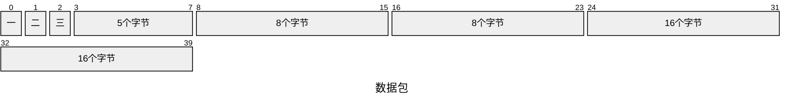
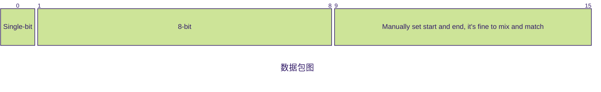
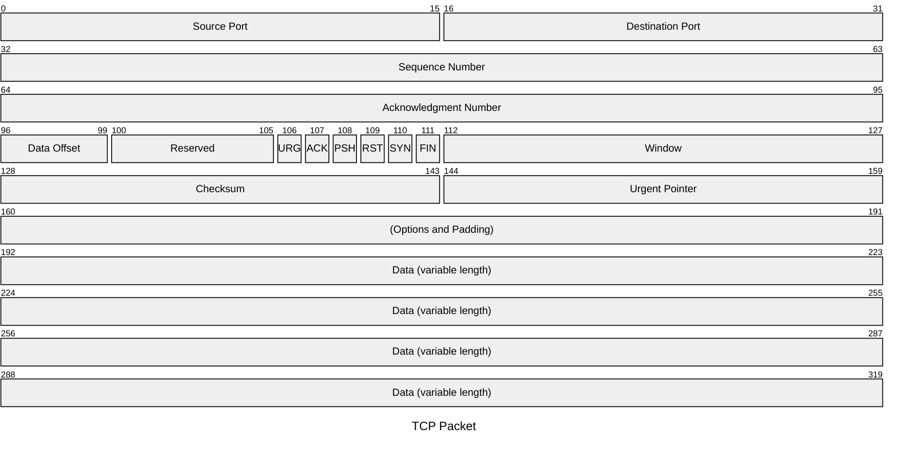

数据包图是用于展示网络数据包结构和内容的一种图，数据包是网络传输数据的基本单位。

这种图对开发者、网络工程师、教师或者需要清晰简洁表示网络数据包结构的学生尤为有用。

[mermaid packet文档](https://mermaid.js.org/syntax/packet.html)

mermaid关键字`packet`，需要mermaid至少`v11.0.0`版本以上才支持。

## 基本语法

packet图默认每行32个字节，字节索引从0开始，可为图设置标题，字节可以单个、多个，每个字节范围后可以添加描述信息，不包含双引号。

::: danger 注意
所有字节索引必须连续，且从0开始。
:::

### 标题

使用`title`关键字，空格后跟标题，无需双引号。

```mmd
packet
title 数据包
```

### 单字节

特定单字节的索引数字代表一个单字节。

```mmd
packet
0: "一"
1: "二"
2: "三"
```

### 起止字节

多个字节可以以前一个字节结束作为开始索引，范围字节数大小作为结束索引。

```mmd
packet
3-7: "5个字节"
8-15: "8个字节"
```

### 字节数

如果一个可能会变动的数据包，使用起止字节来设置，每次增加或减少字节数，后面的字节范围都得重新计算一遍，
这会使得维护这个数据包图变得困难，mermaid提供一种`+N`的语法来表示接下来的N个字节含义。

```mmd
packet
3-7: "5个字节"
+8: "8个字节"
+16: "16个字节"
```

### 合并后的效果



## 配置

配置语法参考[Mermaid自定义配置](/2024-12-08-mermaid-configuration){:target='_blank' rel="noreferrer"}

|    属性名     | 默认值  |    描述    |
|:----------:|:----:|:--------:|
| rowHeight  |  32  |    行高    |
|  bitWidth  |  32  |   字节宽度   |
| bitsPerRow |  32  |  每行字节数   |
|  showBits  | true | 是否显示字节索引 |
|  paddingX  |  5   |  X轴偏移量   |
|  paddingY  |  5   |  Y轴偏移量   |

配置一个每行16字节，宽度、高度比默认大一倍的数据包图。

```mmd
---
title: 数据包图
config:
  theme: 'forest'
  packet: 
    bitsPerRow: 16
    rowHeight: 64
    bitWidth: 64
---

packet
+1: "Single-bit" %% Single-bit block
+8: "8-bit" %% 8-bit block
9-15: "Manually set start and end, it's fine to mix and match"
```



## 综合示例

```mmd
packet
title TCP Packet
0-15: "Source Port"
16-31: "Destination Port"
32-63: "Sequence Number"
64-95: "Acknowledgment Number"
96-99: "Data Offset"
100-105: "Reserved"
106: "URG"
107: "ACK"
108: "PSH"
109: "RST"
110: "SYN"
111: "FIN"
+16: "Window"
+16: "Checksum"
+16: "Urgent Pointer"
+32: "(Options and Padding)"
+128: "Data (variable length)"
```


